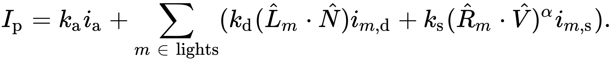
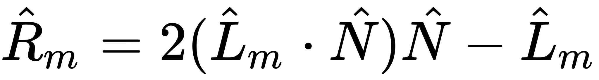
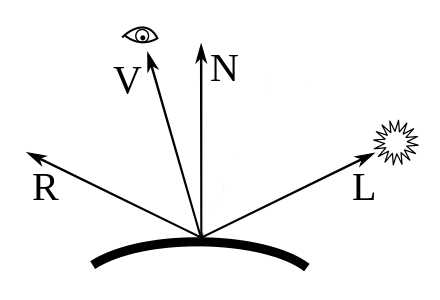

<!--more-->

首先，所有光照模型都是对真实世界光照的近似而已，区别只在于近似到什么程度。下面从最简单到复杂的模型遍历一遍。

# [Phong lighting model](https://en.wikipedia.org/wiki/Phong_reflection_model) （1975年）

Phong模型是针对局部光照的经验模型。先过一遍原理，从wiki给出的2条公式入手：







解释下里面的各个符号：

- \\(k\_\{s\} \\)，镜面反射系数，常量
- \\(k\_\{d\} \\)，漫反射系数，常量
- \\(k\_\{\\alpha \} \\)，环境光反射系数，常量
- \\(\alpha \\) , 表示物体材质光滑程度，由材质决定（材质越光滑系数越大），常量
- \\(\\hat L\_\{m\} \\)，从物体表面上的p点到某光源m的方向向量
- \\(\\hat N \\)，该点的法线
- \\(\\hat R\_\{m\} \\)，出射(反射)光线的方向，相对于\\(\\hat L\_\{m\} \\)而言的。也是从物体表面出发
- \\(\\hat V \\)，摄像机的方向，也是从物体表面出发
- \\(i\_\{\\alpha \} \\)，环境光光照，理解为RGB颜色即可
- \\(i\_\{m,d \} \\)，光源m的漫反射光照，RGB
- \\(i\_\{m,s \} \\)，光源m的镜面反射光照，RGB
- \\(I\_\{p \} \\)，p点的总的光照，RGB

直观地理解这些方向



根据公式可知，Phong模型实质上是三个小模型的叠加：

- ambient lighting：环境光，模拟像月光这种弱光对物体的影响
- diffuse lighting：漫反射光，被(直接)光源照射后反射出来的光
- specular lighting：镜面光，模拟了光滑物体或物体的部分光滑表面被光照时产生的高光现象

除此之外，还有一个object color的概念，是指物体自发光，一般是用纹理表示这种color。


(from wiki)

下面给出单光源下的phong shader。

## ambient lighting

```js
// fs
void main()
{
    float ka = 0.1;
    vec3 ambient = ka * lightColor;

    vec3 result = ambient * objectColor;
    FragColor = vec4(result, 1.0);
}
```


## ambient+diffuse lighting

```js
// vs
void main()
{
    gl_Position = projection * view * model * vec4(aPos, 1.0);
    FragPos = vec3(model * vec4(aPos, 1.0));
    Normal = aNormal;
}

// fs
void main()
{
    float ka = 0.1;
    vec3 ambient = ka * lightColor;

    float kd = 1.0;
    vec3 N = normalize(Normal);
    vec3 L = normalize(lightPos - FragPos);  
    float NdotL = max(dot(N, L), 0.0);
    vec3 diffuse = kd * NdotL * lightColor;

    vec3 result = (ambient + diffuse) * objectColor;
    FragColor = vec4(result, 1.0);
}
```


## ambient+diffuse+specular lighting

```js
// vs
void main()
{
    gl_Position = projection * view * model * vec4(aPos, 1.0);
    FragPos = vec3(model * vec4(aPos, 1.0));
    Normal = aNormal;
}

// fs
void main()
{
    float ka = 0.1;
    vec3 ambient = ka * lightColor;

    float kd = 1.0;
    vec3 N = normalize(Normal);
    vec3 L = normalize(lightPos - FragPos);  
    float NdotL = max(dot(N, L), 0.0);
    vec3 diffuse = kd * NdotL * lightColor;
    
    float ks = 0.5;
    float alpha = 32;
    vec3 V = normalize(viewPos - FragPos);
    vec3 R = reflect(-L, N); 
    float spec = pow(max(dot(V, R), 0.0), alpha);
    vec3 specular = ks * spec * lightColor;  

    vec3 result = (ambient + diffuse + specular) * objectColor;
    FragColor = vec4(result, 1.0);
}
```


# Blinn-Phong

# Lafortune

# Torrance-Sparrow

# Cook-Torrance

# Ward anisotropy

# Oren-Nayar


# 参考资料

https://learnopengl.com/Lighting/Basic-Lighting

https://learnopengl.com/Advanced-Lighting/Advanced-Lighting