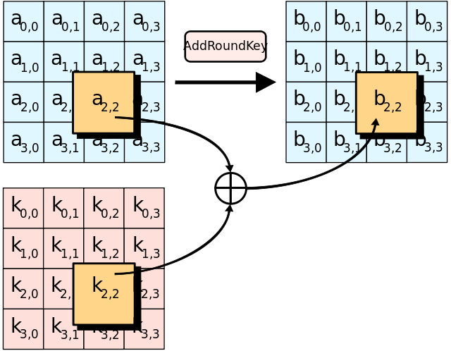
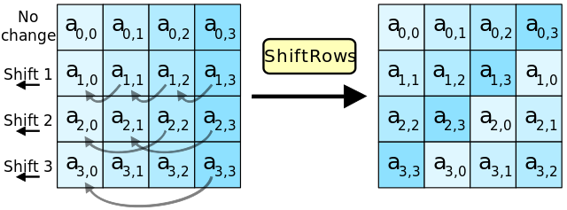
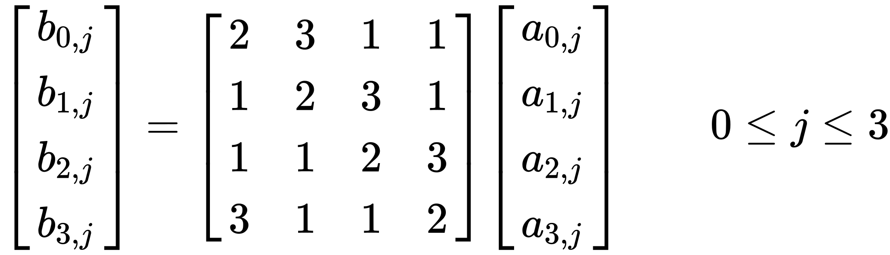
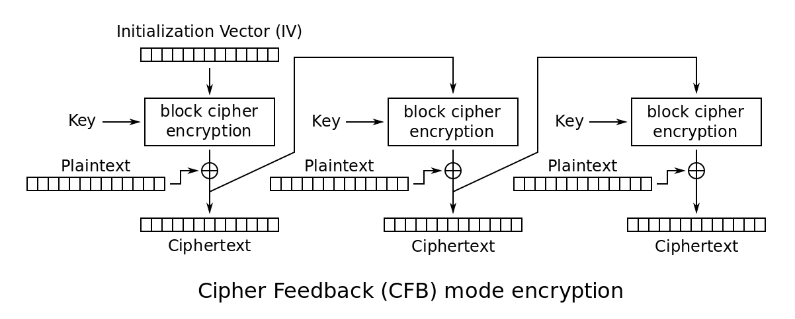

<!--more-->


本文主要目的是剖析AES(Rijndael)的来龙去脉，包括源码实现。

# [AES](https://en.wikipedia.org/wiki/Advanced_Encryption_Standard)

下面以源码剖析的形式来介绍AES。本来打算剖析openSSL里的AES，结果发现代码是高度优化的，很难阅读理解。索性找了个更适合剖析的实现: [tiny-AES-c](https://github.com/kokke/tiny-AES-c)。1000多stars，想必也很靠谱了。

## 流程

### tiny-AES-C总览

以最简单的加密模式ECB为例，ECB的加密解密接口如下：

```c
void AES_ECB_encrypt(struct AES_ctx *ctx, uint8_t* buf)
{
  // The next function call encrypts the PlainText with the Key using AES algorithm.
  Cipher((state_t*)buf, ctx->RoundKey);
}

void AES_ECB_decrypt(struct AES_ctx* ctx, uint8_t* buf)
{
  // The next function call decrypts the PlainText with the Key using AES algorithm.
  InvCipher((state_t*)buf, ctx->RoundKey);
}
```

可见Cipher和InvCipher才是关键，本文主要剖析Cipher：

```c
static void Cipher(state_t* state, uint8_t* RoundKey)
{
  uint8_t round = 0;

  // 第0轮，只做AddRoundKey
  AddRoundKey(0, state, RoundKey); 
  
  // 传说中的“轮函数”，循环9轮
  for (round = 1; round < Nr; ++round)
  {
    // 四大步骤
    SubBytes(state);
    ShiftRows(state);
    MixColumns(state);
    AddRoundKey(round, state, RoundKey);
  }

  // 末尾第10轮要特殊处理：去掉了MixColumns(state)
  SubBytes(state);
  ShiftRows(state);
  AddRoundKey(Nr, state, RoundKey);
}
```

其中的Nr是常数，AES用到的常数如下：

```c
// The number of columns comprising a state in AES. This is a constant in AES. Value=4
#define Nb 4

#if defined(AES256) && (AES256 == 1)
    #define Nk 8
    #define Nr 14
#elif defined(AES192) && (AES192 == 1)
    #define Nk 6
    #define Nr 12
#else
    #define Nk 4        // The number of 32 bit words in a key.
    #define Nr 10       // The number of rounds in AES Cipher.
#endif
```

可见，AES128的Nk为4，Nr为10。

state_t其实就是原文(plaintext)：

```c
typedef uint8_t state_t[4][4];
```

state_t是定长16字节，所以Cipher是用来加密定长块的，更长的原文就需要分块加密。

state_t是二维数组，有列主导还是行主导的问题，state_t是列主导的，即state[column][row]。


下面就按被调用的顺序，逐个击破：AddRoundKey、SubBytes、ShiftRows、MixColumns。


### AddRoundKey

其实就是state和roundkey做xor并覆盖state：



(from [wiki](https://en.wikipedia.org/wiki/Advanced_Encryption_Standard))

```c
static void AddRoundKey(uint8_t round,state_t* state,uint8_t* RoundKey)
{
  uint8_t i,j;
  for (i = 0; i < 4; ++i)
  {
    for (j = 0; j < 4; ++j)
    {
      (*state)[i][j] ^= RoundKey[(round * Nb * 4) + (i * Nb) + j];
    }
  }
}
```


### SubBytes

SubBytes就是对state每一个字节(8bits，0到255），查表sbox（有256个元素，256到256的映射），原地转换：


(from [wiki](https://en.wikipedia.org/wiki/Advanced_Encryption_Standard))

```c
static void SubBytes(state_t* state)
{
  uint8_t i, j;
  for (i = 0; i < 4; ++i)
  {
    for (j = 0; j < 4; ++j)
    {
      (*state)[j][i] = getSBoxValue((*state)[j][i]);
      // (*state)[i][j] = getSBoxValue((*state)[i][j]); 或者这样写，毕竟是方阵
    }
  }
}

static const uint8_t sbox[256] = {
  //0     1    2      3     4    5     6     7      8    9     A      B    C     D     E     F
  0x63, 0x7c, 0x77, 0x7b, 0xf2, 0x6b, 0x6f, 0xc5, 0x30, 0x01, 0x67, 0x2b, 0xfe, 0xd7, 0xab, 0x76,
  0xca, 0x82, 0xc9, 0x7d, 0xfa, 0x59, 0x47, 0xf0, 0xad, 0xd4, 0xa2, 0xaf, 0x9c, 0xa4, 0x72, 0xc0,
  0xb7, 0xfd, 0x93, 0x26, 0x36, 0x3f, 0xf7, 0xcc, 0x34, 0xa5, 0xe5, 0xf1, 0x71, 0xd8, 0x31, 0x15,
  0x04, 0xc7, 0x23, 0xc3, 0x18, 0x96, 0x05, 0x9a, 0x07, 0x12, 0x80, 0xe2, 0xeb, 0x27, 0xb2, 0x75,
  0x09, 0x83, 0x2c, 0x1a, 0x1b, 0x6e, 0x5a, 0xa0, 0x52, 0x3b, 0xd6, 0xb3, 0x29, 0xe3, 0x2f, 0x84,
  0x53, 0xd1, 0x00, 0xed, 0x20, 0xfc, 0xb1, 0x5b, 0x6a, 0xcb, 0xbe, 0x39, 0x4a, 0x4c, 0x58, 0xcf,
  0xd0, 0xef, 0xaa, 0xfb, 0x43, 0x4d, 0x33, 0x85, 0x45, 0xf9, 0x02, 0x7f, 0x50, 0x3c, 0x9f, 0xa8,
  0x51, 0xa3, 0x40, 0x8f, 0x92, 0x9d, 0x38, 0xf5, 0xbc, 0xb6, 0xda, 0x21, 0x10, 0xff, 0xf3, 0xd2,
  0xcd, 0x0c, 0x13, 0xec, 0x5f, 0x97, 0x44, 0x17, 0xc4, 0xa7, 0x7e, 0x3d, 0x64, 0x5d, 0x19, 0x73,
  0x60, 0x81, 0x4f, 0xdc, 0x22, 0x2a, 0x90, 0x88, 0x46, 0xee, 0xb8, 0x14, 0xde, 0x5e, 0x0b, 0xdb,
  0xe0, 0x32, 0x3a, 0x0a, 0x49, 0x06, 0x24, 0x5c, 0xc2, 0xd3, 0xac, 0x62, 0x91, 0x95, 0xe4, 0x79,
  0xe7, 0xc8, 0x37, 0x6d, 0x8d, 0xd5, 0x4e, 0xa9, 0x6c, 0x56, 0xf4, 0xea, 0x65, 0x7a, 0xae, 0x08,
  0xba, 0x78, 0x25, 0x2e, 0x1c, 0xa6, 0xb4, 0xc6, 0xe8, 0xdd, 0x74, 0x1f, 0x4b, 0xbd, 0x8b, 0x8a,
  0x70, 0x3e, 0xb5, 0x66, 0x48, 0x03, 0xf6, 0x0e, 0x61, 0x35, 0x57, 0xb9, 0x86, 0xc1, 0x1d, 0x9e,
  0xe1, 0xf8, 0x98, 0x11, 0x69, 0xd9, 0x8e, 0x94, 0x9b, 0x1e, 0x87, 0xe9, 0xce, 0x55, 0x28, 0xdf,
  0x8c, 0xa1, 0x89, 0x0d, 0xbf, 0xe6, 0x42, 0x68, 0x41, 0x99, 0x2d, 0x0f, 0xb0, 0x54, 0xbb, 0x16 };


#define getSBoxValue(num) (sbox[(num)])

```

要注意，sbox是AES的常量，不可随便修改。

### ShiftRows

所谓shiftRows，就是第i行的左数i个元素，按序左出右进，因为state是4x4矩阵，所以：

- 第0行，不需要shift
- 第1行，左数1个元素，按序左出右进，变成\\( a\_\{1,1\}\ a\_\{1,2\}\ a\_\{1,3\}\ a\_\{1,0\}\  \\)
- 第2行，左数2个元素，按序左出右进，变成\\( a\_\{2,2\}\ a\_\{2,3\}\ a\_\{2,0\}\ a\_\{2,1\}\  \\)
- 第3行，左数3个元素，按序左出右进，变成\\( a\_\{3,3\}\ a\_\{3,0\}\ a\_\{3,1\}\ a\_\{3,2\}\  \\)



(from [wiki](https://en.wikipedia.org/wiki/Advanced_Encryption_Standard))

```c
static void ShiftRows(state_t* state)
{
  uint8_t temp;

  // 记住，state是state[column][row]
  // shift第1行 
  temp           = (*state)[0][1];
  (*state)[0][1] = (*state)[1][1];
  (*state)[1][1] = (*state)[2][1];
  (*state)[2][1] = (*state)[3][1];
  (*state)[3][1] = temp;

  // shift第2行，即0列和2列换、1列和3列换
  temp           = (*state)[0][2];
  (*state)[0][2] = (*state)[2][2];
  (*state)[2][2] = temp;

  temp           = (*state)[1][2];
  (*state)[1][2] = (*state)[3][2];
  (*state)[3][2] = temp;

  // shift第3行 
  temp           = (*state)[0][3];
  (*state)[0][3] = (*state)[3][3];
  (*state)[3][3] = (*state)[2][3];
  (*state)[2][3] = (*state)[1][3];
  (*state)[1][3] = temp;
}
```

### MixColumns

[MixColumns](https://en.wikipedia.org/wiki/Rijndael_MixColumns)是最复杂的一步，连代码都很难看懂在干嘛。必须先补相关数学知识才行。


(from [wiki](https://en.wikipedia.org/wiki/Advanced_Encryption_Standard))

```c
static uint8_t xtime(uint8_t x)
{
  return ((x<<1) ^ (((x>>7) & 1) * 0x1b));
}

// MixColumns function mixes the columns of the state matrix
static void MixColumns(state_t* state)
{
  uint8_t i;
  uint8_t Tmp, Tm, t;
  // 从第0列遍历到第3列
  for (i = 0; i < 4; ++i)
  {  
    t   = (*state)[i][0];
    Tmp = (*state)[i][0] ^ (*state)[i][1] ^ (*state)[i][2] ^ (*state)[i][3] ;
    Tm  = (*state)[i][0] ^ (*state)[i][1] ; Tm = xtime(Tm);  (*state)[i][0] ^= Tm ^ Tmp ;
    Tm  = (*state)[i][1] ^ (*state)[i][2] ; Tm = xtime(Tm);  (*state)[i][1] ^= Tm ^ Tmp ;
    Tm  = (*state)[i][2] ^ (*state)[i][3] ; Tm = xtime(Tm);  (*state)[i][2] ^= Tm ^ Tmp ;
    Tm  = (*state)[i][3] ^ t ;              Tm = xtime(Tm);  (*state)[i][3] ^= Tm ^ Tmp ;
  }
}
```

## 什么是mixColumns

首先要讲2个概念：[Confusion](https://en.wikipedia.org/wiki/Confusion_and_diffusion)(混淆)和[Diffusion](https://en.wikipedia.org/wiki/Confusion_and_diffusion)(扩散)。

- Confusion：密文的每一bit应该和秘钥的多个部分相关，使得密文和密钥的联系变得含糊。

- Diffusion：即如果我们改变**原文**的单个bit，会导致**密文**里一半(平均统计值）的bits发生改变；类似的，如果改变**密文**的单个bit，会导致**原文**一半的bits发生改变。又因为一个bit只有2个状态，如果随机地改变某个bit的位置，也会导致密文(或原文)一半的bits发生改变。


这2个概念搞懂后，开始看mixColumns。（mixColumns其实有专门的[wiki](https://en.wikipedia.org/wiki/Rijndael_MixColumns)介绍。）

mixColumns其实就是AES算法里最主要的产生Diffusion效果的步骤。

state的每一列被当成四项多项式的4个系数（4个bytes)：

\\[ a(x) = a\_\{3}x\^\{3\} + a\_\{2}x\^\{2\} + a\_\{1}x + a\_\{0} \\]

用图表示：



(from [wiki](https://en.wikipedia.org/wiki/Advanced_Encryption_Standard))

中间这个奇怪的4x4矩阵叫MDS矩阵，mixColumns的[wiki](https://en.wikipedia.org/wiki/Rijndael_MixColumns)有推导过程，另外我还找到一份可能更好理解的[推导过程](https://crypto.stackexchange.com/questions/51447/aes-mix-column-transformation)。

综合这2份资料，下面解释下推导过程。

首先，mixColumns有2个“常数”性质的多项式：

- 固定多项式：\\( 3x\^\{3\} + x\^\{2\} + x + 2 \\)
- 多项式乘法模：\\( x\^\{4\} + 1 \\)

让上面的列系数多项式和固定多项式相乘并展开结果：

\\( (a\_\{3}x\^\{3\} + a\_\{2}x\^\{2\} + a\_\{1}x + a\_\{0})\cdot (3x\^\{3\} + x\^\{2\} + x + 2) \\)

\\( = 3a\_\{3}x\^\{6\} + 1a\_\{3}x\^\{5\}  + 1a\_\{3}x\^\{4\} + 2a\_\{3}x\^\{3\} + \\)

\\(  3a\_\{2}x\^\{5\} + 1a\_\{2}x\^\{4\}  + 1a\_\{2}x\^\{3\} + 2a\_\{2}x\^\{2\} + \\)

\\(  3a\_\{1}x\^\{4\} + 1a\_\{1}x\^\{3\}  + 1a\_\{1}x\^\{2\} + 2a\_\{1}x\^\{1\} + \\)

\\(  3a\_\{0}x\^\{3\} + 1a\_\{0}x\^\{2\}  + 1a\_\{0}x\^\{1\} + 2a\_\{0}x\^\{0\} \\)

共有16项（MDS4x4矩阵的由来），但其中有的项的x的次数已经大于等于4，而我们需要的是x小于等于3次的多项式。怎么办呢？这时候就要拿出上面的模数\\( x\^\{4\} + 1 \\)。

多项式怎么做模运算？先回顾简单代数的模运算：

当2个整数a、b的差等于k个整数n的积时（k可以是任意整数）有:\\( a - b = kn \\)，可以写成：\\(a \equiv b (mod \ n) \\)。

于是多项式的模运算定义如下：

\\[ a(x) \equiv b(x) (mod \ P(x)) \\]

也即是说，可以用下面的公式求解多项式a(x)关于P(x)的模b(x)：

\\[ a(x) = x\^\{k} P(x) + b(x) \\]

那么令\\( P(x) = x\^\{4\} + 1 \\)，\\( a(x) = x\^\{6\} \\)，有：

\\[ x\^\{6\} = x\^\{2}(x\^\{4\} + 1) - x\^\{2} \\]

可知\\(b(x) = - x\^\{2} \\)，因为在AES里不存在负数的系数（系数是无符号单字节），所以“暴力地”写成\\( x\^\{6\} \equiv x\^\{2} (mod \ (x\^\{4\} + 1)) \\)，

同理可得：

\\( x\^\{5\} \equiv x\^\{1} (mod \ (x\^\{4\} + 1)) \\)

\\( x\^\{4\} \equiv x\^\{0} (mod \ (x\^\{4\} + 1)) \\)

于是可以列出通用公式：

\\( x\^\{i\} \equiv x\^\{i \ mod \ 4\} (mod \ (x\^\{4\} + 1)) \\)

有了这个公式当武器后，前面的16项多项式就可以继续化简了，对等式两边同时取模\\( x\^\{4\} + 1 \\)：

\\( = (3a\_\{3}x\^\{6\} + 1a\_\{3}x\^\{5\}  + 1a\_\{3}x\^\{4\} + 2a\_\{3}x\^\{3\} + \\)

\\(  3a\_\{2}x\^\{5\} + 1a\_\{2}x\^\{4\}  + 1a\_\{2}x\^\{3\} + 2a\_\{2}x\^\{2\} + \\)

\\(  3a\_\{1}x\^\{4\} + 1a\_\{1}x\^\{3\}  + 1a\_\{1}x\^\{2\} + 2a\_\{1}x\^\{1\} + \\)

\\(  3a\_\{0}x\^\{3\} + 1a\_\{0}x\^\{2\}  + 1a\_\{0}x\^\{1\} + 2a\_\{0}x\^\{0\} ) \ mod \ (x\^\{4\} + 1) \\)

\\( \equiv 3a\_\{3}x\^\{2\} + 1a\_\{3}x\^\{1\}  + 1a\_\{3}x\^\{0\} + 2a\_\{3}x\^\{3\} + \\)

\\(  3a\_\{2}x\^\{1\} + 1a\_\{2}x\^\{0\}  + 1a\_\{2}x\^\{3\} + 2a\_\{2}x\^\{2\} + \\)

\\(  3a\_\{1}x\^\{0\} + 1a\_\{1}x\^\{3\}  + 1a\_\{1}x\^\{2\} + 2a\_\{1}x\^\{1\} + \\)

\\(  3a\_\{0}x\^\{3\} + 1a\_\{0}x\^\{2\}  + 1a\_\{0}x\^\{1\} + 2a\_\{0}x\^\{0\} \\)

按次数大小整理下顺序：


\\( \equiv 2a\_\{3}x\^\{3\} + 3a\_\{3}x\^\{2\} + 1a\_\{3}x\^\{1\}  + 1a\_\{3}x\^\{0\} + \\)

\\(   1a\_\{2}x\^\{3\} + 2a\_\{2}x\^\{2\} + 3a\_\{2}x\^\{1\} + 1a\_\{2}x\^\{0\}  + \\)

\\(  1a\_\{1}x\^\{3\}  + 1a\_\{1}x\^\{2\} + 2a\_\{1}x\^\{1\} + 3a\_\{1}x\^\{0\} + \\)

\\(  3a\_\{0}x\^\{3\} + 1a\_\{0}x\^\{2\}  + 1a\_\{0}x\^\{1\} + 2a\_\{0}x\^\{0\} \\)

再合并成4个等式:

\\( b\_\{0}x\^{0} = (1a\_\{3} + 1a\_\{2} + 3a\_\{1} + 2a\_\{0})x\^{0} = (2a\_\{0} + 3a\_\{1} + 1a\_\{2} + 1a\_\{3})x\^{0}  \\)

\\( b\_\{1}x\^{1} = (1a\_\{3} + 3a\_\{2} + 2a\_\{1} + 1a\_\{0})x\^{1} = (1a\_\{0} + 2a\_\{1} + 3a\_\{2} + 1a\_\{3})x\^{1}  \\)

\\( b\_\{2}x\^{2} = (3a\_\{3} + 2a\_\{2} + 1a\_\{1} + 1a\_\{0})x\^{2} = (1a\_\{0} + 1a\_\{1} + 2a\_\{2} + 3a\_\{3})x\^{2}  \\)

\\( b\_\{3}x\^{3} = (2a\_\{3} + 1a\_\{2} + 1a\_\{1} + 3a\_\{0})x\^{3} = (3a\_\{0} + 1a\_\{1} + 1a\_\{2} + 2a\_\{3})x\^{3}  \\)

把x去掉并整理成矩阵相乘的形式：








\\[  =   \\]

现在分析对比下源码里的xtime函数和[wiki](https://en.wikipedia.org/wiki/Rijndael_MixColumns)给出的等价代码:

```c
static uint8_t xtime(uint8_t x)
{
    return ((x<<1) ^ (((x>>7) & 1) * 0x1b));
}

// 整理过的：
static uint8_t xtime2(uint8_t x) 
{
    return ((x<<1) ^ ((unsigned char)((signed char)x >> 7) & 0x1b));
}
/*
    原始代码段：
    h = (unsigned char)((signed char)r[c] >> 7); // arithmetic right shift, thus shifting in either zeros or ones 
    b[c] = r[c] << 1; // implicitly removes high bit because b[c] is an 8-bit char, so we xor by 0x1b and not 0x11b in the next line 
    b[c] ^= 0x1B & h; // Rijndael's Galois field 
*/

// 测试通过：
for(uint8_t i = 0; i < uint8_t(-1); i++) {
    assert(xtime(i) == xtime2(i));
}
```

经过以上测试，发现只是写法不同，那么xtime是什么意思呢？逐步分析下：

- 第一种：((x<<1) ^ (((x>>7) & 1) * 0x1b));
- 第二种：((x<<1) ^ ((unsigned char)((signed char)x >> 7) & 0x1b));

观察发现是后半段有差异，后半段的差异在于有无显式类型转化、有无&1，*0x1b还是&0x1b。根据x最高位是否为1，可分2种情况：

第一种：

- x最高位为1：((x>>7) & 1)等于1，(((x>>7) & 1) * 0x1b))等于0x1b
- x最高位为0：((x>>7) & 1)等于0，(((x>>7) & 1) * 0x1b))等于0x00

第二种：

- x最高位为1：(unsigned char)((signed char)x >> 7)等于0xff，&0x1b后等于0x1b
- x最高位为0：(unsigned char)((signed char)x >> 7)等于0x00，&0x1b后等于0x00

经过枚举后，就知道了xtime其实可以化简成：

- x最高位为1：(x<<1) ^ 0x1b
- x最高位为0：(x<<1) ^ 0x00

其中的0x1b也是一个多项式系数，写成二进制就是0b00011011，写成多项式就是：

\\[ x\^{4} + x\^{3} + x + 1 \\]


## 资料：

https://github.com/kokke/tiny-AES-c

https://github.com/matt-wu/AES

[AES对称密码算法介绍(0)——数学知识简介](https://zhuanlan.zhihu.com/p/41648498)

[AES对称密码算法介绍(1)——AES的内部结构](https://zhuanlan.zhihu.com/p/41716899)

https://www.cnblogs.com/luop/p/4334160.html

https://csrc.nist.gov/csrc/media/projects/cryptographic-standards-and-guidelines/documents/aes-development/rijndael-ammended.pdf#page=3

# 各种加密模式

openSSL实现了多种模式的AES，代码结构很清晰，不同模式有不同的代码文件。

AES的目录：/crypto/aes/，各种模式的目录：/crypto/modes/


## ECB

### ECB加密流程图


(from [wiki](https://en.wikipedia.org/wiki/Block_cipher_mode_of_operation))

这个做法超简单，也意味着很不安全，尤其是原文会重复的情况。

用一张图解释为什么ECB不安全：


(from [here](https://students.cs.byu.edu/~cs465ta/homework/ECBReview.html))

## CBC

### CBC加密流程图


(from [wiki](https://en.wikipedia.org/wiki/Block_cipher_mode_of_operation))


\\[ C\_\{i\} = E\_\{K\}(C\_\{i - 1\}\oplus P\_\{i\})  \\]

\\[ C\_\{0\} = IV  \\]

其实就是三个步骤的无限循环

1. 块原文和iv异或
2. 块原文加密，输出块密文
3. 把iv设为块密文

优点：

1. 安全性优于ECB

缺点：

1. 多了一个初始化向量IV的问题
2. 因为块与块之间耦合，误差会传递
3. 不能并行计算、随机读取


### CBC加密代码

```c
void CRYPTO_cbc128_encrypt(const unsigned char *in, unsigned char *out,
                           size_t len, const void *key,
                           unsigned char ivec[16], block128_f block)
{
    ···
    // 抽象出来就是这么一段代码
    while (len >= 16) {
        // 第一步
        for (n = 0; n < 16; ++n)
            out[n] = in[n] ^ iv[n];
        // 第二步
        (*block) (out, out, key);
        // 第三步
        iv = out;
        len -= 16;
        in += 16;
        out += 16;
    }
    ···
}
```


## CFB


### CFB加密流程图




(from [wiki](https://en.wikipedia.org/wiki/Block_cipher_mode_of_operation))

\\[ C\_\{i\} = E\_\{K\}(C\_\{i - 1\})\oplus P\_\{i\}  \\]

\\[ C\_\{0\} = IV  \\]

看公式可以发现和CBC很像。


### CFB加密代码

```c
void CRYPTO_cfb128_encrypt(const unsigned char *in, unsigned char *out,
                           size_t len, const void *key,
                           unsigned char ivec[16], int *num,
                           int enc, block128_f block)
{
    unsigned int n;
    size_t l = 0;

    n = *num;
···
    if (16 % sizeof(size_t) == 0) { /* always true actually */
        do {
            while (n && len) {
                *(out++) = ivec[n] ^= *(in++);
                --len;
                n = (n + 1) % 16;
            }
            while (len >= 16) {
                // 第一步 加密IV
                (*block) (ivec, ivec, key);
                // 第二步 和块原文异或输出块密文，同时IV变为块密文
                for (; n < 16; n += sizeof(size_t)) {
                    *(size_t *)(out + n) =
                        *(size_t *)(ivec + n) ^= *(size_t *)(in + n);
                }
                len -= 16;
                out += 16;
                in += 16;
                n = 0;
            }
            if (len) {
                (*block) (ivec, ivec, key);
                while (len--) {
                    out[n] = ivec[n] ^= in[n];
                    ++n;
                }
            }
            *num = n;
            return;
        } while (0);
    }
···
}
```

CFB的加解密几乎一致，有微小区别，于是就用了enc变量来判断是加密还是解密，从而用一个函数搞定CFB。


## OFB


### OFB加密流程图


(from [wiki](https://en.wikipedia.org/wiki/Block_cipher_mode_of_operation))


### OFB加密代码

```c
void CRYPTO_ofb128_encrypt(const unsigned char *in, unsigned char *out,
                           size_t len, const void *key,
                           unsigned char ivec[16], int *num, block128_f block)
{
    unsigned int n;
    size_t l = 0;

    n = *num;
···
    if (16 % sizeof(size_t) == 0) { /* always true actually */
        do {
            while (n && len) {
                *(out++) = *(in++) ^ ivec[n];
                --len;
                n = (n + 1) % 16;
            }
            while (len >= 16) {
                // 循环加密IV
                (*block) (ivec, ivec, key);
                // 加密后的IV和块原文异或，输出块密文
                for (; n < 16; n += sizeof(size_t))
                    *(size_t *)(out + n) =
                        *(size_t *)(in + n) ^ *(size_t *)(ivec + n);
                len -= 16;
                out += 16;
                in += 16;
                n = 0;
            }
            if (len) {
                (*block) (ivec, ivec, key);
                while (len--) {
                    out[n] = in[n] ^ ivec[n];
                    ++n;
                }
            }
            *num = n;
            return;
        } while (0);
    }
    *num = n;
···
}
```

OFB只需要一个CRYPTO_ofb128_encrypt，解密也是用这个函数，加解密的流程是完全对称的。


## CTR


### CTR加密流程图


(from [wiki](https://en.wikipedia.org/wiki/Block_cipher_mode_of_operation))

从图中就可以看出，CTR模式每个块之间的加密是解耦的，于是就有了并行计算的可能性。

### CTR加密代码

```c
void CRYPTO_ctr128_encrypt(const unsigned char *in, unsigned char *out,
                           size_t len, const void *key,
                           unsigned char ivec[16],
                           unsigned char ecount_buf[16], unsigned int *num,
                           block128_f block)
{
    unsigned int n;
    size_t l = 0;

    n = *num;

    if (16 % sizeof(size_t) == 0) { /* always true actually */
        do {
            while (n && len) {
                *(out++) = *(in++) ^ ecount_buf[n];
                --len;
                n = (n + 1) % 16;
            }
            while (len >= 16) {
                // 先加密IV，输出到ecount_buf
                (*block) (ivec, ecount_buf, key);
                // IV加1
                ctr128_inc_aligned(ivec);
                // 用ecount_buf去和块原文异或，输出块密文
                for (n = 0; n < 16; n += sizeof(size_t))
                    *(size_t *)(out + n) =
                        *(size_t *)(in + n) ^ *(size_t *)(ecount_buf + n);
                len -= 16;
                out += 16;
                in += 16;
                n = 0;
            }
            if (len) {
                (*block) (ivec, ecount_buf, key);
                ctr128_inc_aligned(ivec);
                while (len--) {
                    out[n] = in[n] ^ ecount_buf[n];
                    ++n;
                }
            }
            *num = n;
            return;
        } while (0);
    }
    *num = n;
}
```


## XEX和XTS

XEX = Xor–encrypt–xor

XTS = XEX-based tweaked-codebook mode with ciphertext stealing

XEX：


(from [wiki](https://en.wikipedia.org/wiki/Disk_encryption_theory#XTS))


可以看到，用来加密原文的X，和三个参数有关：I(IV)、α、j，其中j相当于数组下标，另外2个是常量。因此这个算法是支持随机解密的，只需要知道块的编号j。适合做硬盘数据加密。

XTS：


XEX或XTS的特点还有双key双加密算法，下面是openSSL关于XTS的代码：

```c
struct xts128_context {
    void *key1, *key2;
    block128_f block1, block2;
};
```


## [GCM](https://en.wikipedia.org/wiki/Galois/Counter_Mode)


GCM有多牛，牛到有人专门录教学来介绍GCM：

https://www.cryptologie.net/article/277/what-is-gcm-galois-counter-mode/

根据wiki介绍，GCM实质是在CTR模式基础上增加一个Galois Mode，这个mode就是做认证用的（密文完整性）。

看上图也可以发现，前三行和前文的CTR流程图是一样的。


参考资料：

https://blog.csdn.net/mrpre/article/details/79324505