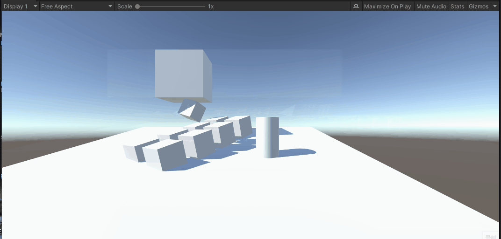
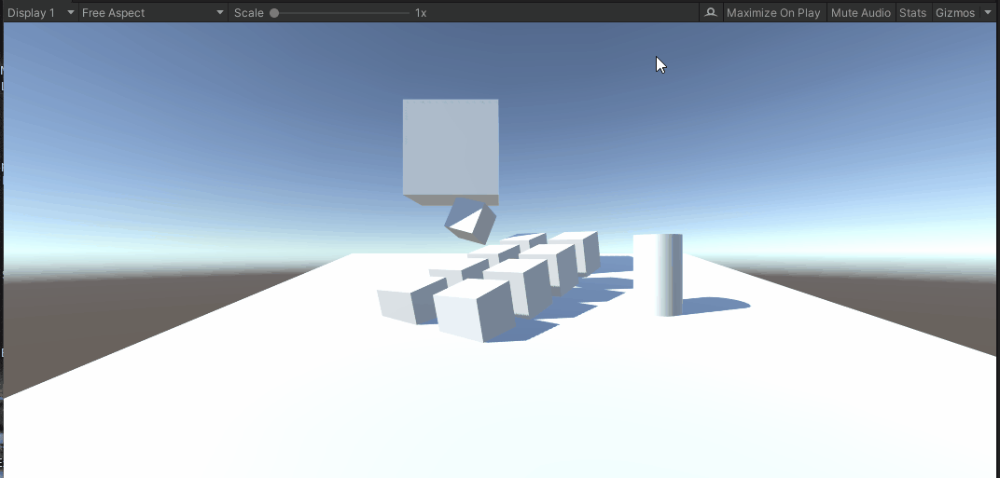
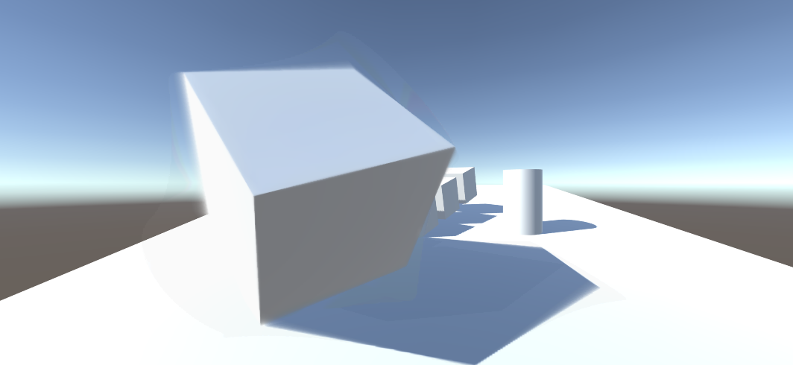
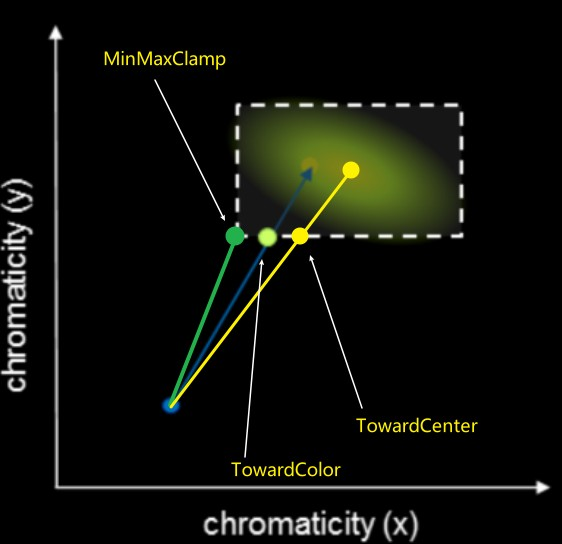

<!--more-->


# TAA基础步骤

1. 每帧绘制前jitter一下主相机的投影矩阵
2. 每帧做一个TAA后处理：将历史帧和当前帧混合

## jitter

所谓jitter就是说抖动一下相机视椎体位置（整体平移，但长宽不变），实现每帧绘制不同的子像素，实现多重采样。

每帧x、y方向抖动多少距离，不是完全随机的，而是要弄一个低差异序列。算出offset后，需要应用到投影矩阵，具体的数学原理看下面的文章：

[线性代数之透视矩阵Perspective Matrix](https://www.qiujiawei.com/linear-algebra-12/)

jitter后，如果什么都不做，只是显示当前帧到screen，会发现什么变化都没有，该锯齿还是锯齿（但这种子像素抖动不会导致整个屏幕抖动，如果是静态场景渲染，画面还是静止的）。

在Unity中做jitter，只需要**在OnPreCull里修改Camera.main.projectionMatrix**，以下算法来自UE4：

```c#

public class CustomTAA : MonoBehaviour
{
    float Halton(uint Index, uint Base)
    {
        float Result = 0.0f;
        float InvBase = 1.0f / Base;
        float Fraction = InvBase;
        while (Index > 0)
        {
            Result += (Index % Base) * Fraction;
            Index /= Base;
            Fraction *= InvBase;
        }
        return Result;
    }

    private void OnPreCull()
    {
        float u1 = Halton(frame_index + 1, 2);
        float u2 = Halton(frame_index + 1, 3);
        frame_index += 1;
        float Sigma = 0.47f;
        
        float OutWindow = 0.5f;
        float InWindow = (float)Math.Exp(-0.5 * Math.Pow(OutWindow / Sigma, 2));

        float Theta = 2.0f * (float)Math.PI * u2;
        float r = Sigma * (float)Math.Sqrt((float)(-2.0f * Math.Log((float)((1.0f - u1) * InWindow + u1))));  // r < 0.5

        float SampleX = r * (float)Math.Cos((double)Theta);
        float SampleY = r * (float)Math.Sin((double)Theta);

        float x = SampleX * 2.0f / Camera.main.pixelWidth;
        float y = SampleY * 2.0f / Camera.main.pixelHeight;


        Camera.main.ResetProjectionMatrix();
        var m = Camera.main.projectionMatrix;
        m.m02 += x;
        m.m12 += y;
        Camera.main.projectionMatrix = m;
    }  
}
```

其中的SampleX和SampleY下文还会用到，它们的单位是像素。

将这个CustomTAA脚本挂到Camera对象即可。

## 历史帧混合

上面jitter步骤只是影响了投影矩阵。但如果将当前帧图像缓存起来，变成历史帧纹理，那么下一帧就可以读取这个历史帧进行混合渲染。

这个步骤也很简单，先在脚本里添加OnRenderImage函数：

```c#
public class CustomTAA : MonoBehaviour
{
    [Range(0.0001f, 0.9999f)]
    public float blendAlpha = 0.9f;
    RenderTexture history_rt, temp_rt;
    bool firstFrame = true;
    uint frame_index = 0;
    [SerializeField]
    Material mat;

    private void OnRenderImage(RenderTexture source, RenderTexture destination)
    {
        if (firstFrame)
        {
            history_rt = new RenderTexture(Screen.width, Screen.height, 0, RenderTextureFormat.ARGBHalf);
            history_rt.dimension = UnityEngine.Rendering.TextureDimension.Tex2D;
            history_rt.Create();
            temp_rt = new RenderTexture(history_rt);
            temp_rt.Create();
            Graphics.Blit(source, history_rt);
            Graphics.Blit(source, destination);
            firstFrame = false;
        }
        else
        {
            if (mat == null)
                Graphics.Blit(source, destination);
            else
            {
                mat.SetTexture("_HistoryTex", history_rt);
                mat.SetTexture("_CurrentTex", source);
                mat.SetFloat("_BlendAlpha", blendAlpha);
                // 这里需要一个temp_rt是因为，如果只有一个history_rt
                // 那么就无法实现采样history_rt的同时，写入history_rt Blit会异常
                Graphics.Blit(source, temp_rt, mat);
                Graphics.Blit(temp_rt, history_rt);
                Graphics.Blit(temp_rt, destination);
            }
        }
    }
}
```

完整的shader代码：

```c
Shader "Custom/CustomTAA"
{
	Properties
	{
	}

	CGINCLUDE
	#pragma only_renderers ps4 xboxone d3d11 d3d9 xbox360 opengl glcore gles3 metal vulkan
	#pragma target 3.0


	#include "UnityCG.cginc"

	sampler2D _HistoryTex;
	sampler2D _CurrentTex;
	float _BlendAlpha;

	struct v2f
	{
		float4 cs_pos : SV_POSITION;
		float2 uv : TEXCOORD0;
	};

	v2f vert(appdata_img IN)
	{
		v2f OUT;
		OUT.cs_pos = UnityObjectToClipPos(IN.vertex);
		OUT.uv = IN.texcoord.xy;
		return OUT;
	}

	fixed4 frag(v2f i) : SV_Target
	{
		fixed4 c = tex2D(_CurrentTex, i.uv);
		fixed4 h = tex2D(_HistoryTex, i.uv);
		return lerp(c, h, _BlendAlpha);
	}
    ENDCG

	SubShader
	{
		ZTest Always Cull Off ZWrite Off
		Fog{ Mode off }

		Pass
		{
			CGPROGRAM

			#pragma vertex vert
			#pragma fragment frag

			ENDCG
		}
	}

	Fallback off
}

```

创建对应的材质并绑定：


结果如下：


（no TAA）


（after TAA）

其实这就是后处理了，都是Blit操作。

其中要注意的是，混合alpha太低的话，即使是静态场景+固定相机，画面也会剧烈抖动。

# TAA的第一个问题-ghosting

拖动场景中的方块，会出现这样的效果（为了让ghosting更明显，blend alpha设到0.9，即历史帧占比90%）：


不移动方块，只移动相机，会出现全屏ghosting：


# ghosting的应对方法-Reprojection

ghosting是因为物体运动或者相机运动产生的。运动导致采样错了历史帧的像素。那么如何知道当前像素在历史帧里的坐标（对应像素）呢？

假设一种简单的情况：**场景里只有相机运动，且当前帧的模型的所有像素，都能在历史帧里找到对应的像素**。

找对应像素的思路如下（用倒推的方式表达）：

1. 假设物体上的一点P在当前帧的光栅化uv坐标是p，在上一帧的uv坐标是q
2. 那么用q去采样历史帧，就能拿到正确的采样值
3. 为了算q，需要在CPU端记录上一帧的VP矩阵：previousViewProjectionMatrix
4. 有了PreVP还不行，还需要P点的世界坐标worldPos（注意，worldPos是不变的，因为我们假设了只有相机运动），可以用当前帧的深度buffer（TAA是一个后处理，必然有深度buffer），还原P点的世界坐标

示意图：


（INSIDE TAA)

第4步用depth计算worldPos，在defer渲染框架下是非必须的，因为GBuffer一般会输出worldPos。

unity中根据深度buffer算world pos的shader代码：

```c++
float rawDepth = SAMPLE_DEPTH_TEXTURE(_CameraDepthTexture, i.uv); // current frame depth
float4 cs = float4(i.uv.x*2.0 - 1.0, (i.uv.y)*2.0 - 1.0, rawDepth, 1.0); // current frame clip space
float4 ws = mul(_InvViewProjMatrix, cs);
ws /= ws.w;
```

非unity环境，上面的代码可能是不一样的，可以用一个pass输出world pos贴图（RGBFloat格式），即GBuffer，然后和上面的从深度重建的world pos算一个距离distance，如果全屏都是黑色的，那就没错了。

然后就是用world pos和上一帧的VP矩阵，手动算出UV坐标（即光栅化阶段的输出）：

```c++
// shader code
float4 cs = mul(_PreviousViewProjection, float4(ws.xyz, 1)); // prev frame clip space
float4 ndc = cs / cs.w; // prev frame ndc
float2 uv = ndc.xy * 0.5 + 0.5; // prev frame uv
```

```c++
// script code
// _PreviousViewProjection uniform
previousViewProjectionMatrix = GL.GetGPUProjectionMatrix(Camera.main.projectionMatrix, false) * Camera.main.worldToCameraMatrix;
```

到了这里有个大坑是，这个算出来的uv是用当前帧有jitter的uv的算的，需要先减去当前帧的jitter，然后补回上一帧的jitter，才是上一帧对应的uv。然后就可以采样上一帧的画面，做混合了：

```c++
// shader code
float4 c = tex2D(_CurrentTex, i.uv);
float4 h = tex2D(_HistoryTex, uv + _JitterUV.zw - _JitterUV.xy);
float4 to_screen = lerp(c, h, _BlendAlpha);
```


float4 _JitterUV里存了当前帧和上一帧的uv jitter距离，_JitterUV需要在TAA Pass前更新：

```c++
// script code
public Vector4 activeSample = Vector4.zero;

// update before frame draw：
activeSample.z = activeSample.x;
activeSample.w = activeSample.y;
activeSample.x = SampleX;
activeSample.y = SampleY;

// convert activeSample to uv space
Vector4 jitterUV = activeSample;
jitterUV.x /= source.width;
jitterUV.y /= source.height;
jitterUV.z /= source.width;
jitterUV.w /= source.height;
mat.SetVector("_JitterUV", jitterUV);
```

静态场景，关闭和开启TAA效果如下：


(No AA)


(Simple TAA)

静态场景+动态相机+jitter，关闭和开启Reprojection的效果如下：




(No Reprojection)



(With Reprojection)

可以看出Reprojection后仍存在ghosting现象。在物体内部区域ghosting大大减少了，但是在边界附近还是出现了。

# reprojection更好的做法-速度图

上面的简单情况只能解决仅有摄像机移动的情况，当物体和相机都运动时，上面的算法是行不通的。

于是就有了VelocityBuffer RT，用单独的一张RT，记录uv变化关系，设A点在N-1帧的uv坐标为\\( P\_\{uv\} \\)，A点在N帧的uv坐标为\\( Q\_\{uv\} \\)，那么速度图里保存的就是\\( Q\_\{uv\} - P\_\{uv\} \\)，也叫motion vector。

注意这是屏幕空间的算法，速度图里的motion vector指的都是当前帧深度最近点的uv变化。被遮挡的像素就不用管了。


INSIDE的temporal demo的速度图绘制步骤大概如下：

1. 后处理pre pass，仅用当前帧深度图和PreVP矩阵，重建上一帧的world pos并算出uv，输出motion vector（和上一节的算法一样，只是输出不同）。这个步骤应该是为了计算天空背景在不同相机视角下的uv变化。这一步不做深度测试也不写深度。
2. 场景对象各自记录CurrM、PrevM 2个矩阵，并在pre passs后绘制一遍场景对象（开销极大，应该在GBuffer里同时做），算出相邻两帧的uv坐标，得到各个对象的motion vector，并输出到同一个RT。这一步要开深度写入和深度测试，并且被遮挡的像素可以提前discard。注意带骨骼动画的对象需要做蒙皮再计算。
3. 可选的后处理post pass，对已经绘制好的速度图，再按tile或neighbour，过滤一遍Motion vector。应该是为了优化速度图的效果。

速度图绘制到RT后，用renderdoc查看要注意一下，因为uv差可能是负数，所以直接看RGFloat格式的速度图，可能屏幕是黑的。问题不大。

TAA后处理pass的代码调整如下：

```c++
float4 c = tex2D(_CurrentTex, i.uv);
float2 ss_vel = tex2D(_VelocityTex, iuv).xy;
h = tex2D(_HistoryTex, i.uv - ss_vel); // 相比上面的reprojection，速度图采样不需要管jitter偏移了。原因是速度图的生成算法不太一样
float4 to_screen = lerp(c, h, _BlendAlpha);
```


但速度图其实作用挺有限，毕竟上一节已经展示了：静态场景下只有摄像机移动+reprojection后，画面依然会有ghosting。而速度图是物体和相机都运动时，屏幕空间下只有物体边界会ghosting：



(可以看到这个大cube旋转时，内部区域的AA也是正确的)

所以速度图是有效的，但只比Reprojection好一些。

# 速度图的采样优化-Velocity Dilation

直接用屏幕uv采样速度图的得到的速度并不是那么可靠的，TAA后的模型边界可能会模糊（有一层虚影）。

解决办法是，先采样周围若干相邻像素点的深度值，找到离相机最近的像素点，以这个像素点的速度为准（这个问题的本质还是不明白）：

```c++
#if UNITY_REVERSED_Z
#define ZCMP_GT(a, b) (a < b)
#else
#define ZCMP_GT(a, b) (a > b)
#endif

float3 find_closest_fragment_3x3(float2 uv)
{
    float2 dd = abs(_CameraDepthTexture_TexelSize.xy);
    float2 du = float2(dd.x, 0.0);
    float2 dv = float2(0.0, dd.y);

    // 获取当前像素周围9个点的深度
    float3 dtl = float3(-1, -1, SAMPLE_DEPTH_TEXTURE(_CameraDepthTexture, uv - dv - du));
    float3 dtc = float3(0, -1, SAMPLE_DEPTH_TEXTURE(_CameraDepthTexture, uv - dv));
    float3 dtr = float3(1, -1, SAMPLE_DEPTH_TEXTURE(_CameraDepthTexture, uv - dv + du));

    float3 dml = float3(-1, 0, SAMPLE_DEPTH_TEXTURE(_CameraDepthTexture, uv - du));
    float3 dmc = float3(0, 0, SAMPLE_DEPTH_TEXTURE(_CameraDepthTexture, uv));
    float3 dmr = float3(1, 0, SAMPLE_DEPTH_TEXTURE(_CameraDepthTexture, uv + du));

    float3 dbl = float3(-1, 1, SAMPLE_DEPTH_TEXTURE(_CameraDepthTexture, uv + dv - du));
    float3 dbc = float3(0, 1, SAMPLE_DEPTH_TEXTURE(_CameraDepthTexture, uv + dv).x);
    float3 dbr = float3(1, 1, SAMPLE_DEPTH_TEXTURE(_CameraDepthTexture, uv + dv + du));

    // 找出离这9个点里面深度最小的（离屏幕最近的）
    float3 dmin = dtl;
    if (ZCMP_GT(dmin.z, dtc.z)) dmin = dtc;
    if (ZCMP_GT(dmin.z, dtr.z)) dmin = dtr;

    if (ZCMP_GT(dmin.z, dml.z)) dmin = dml;
    if (ZCMP_GT(dmin.z, dmc.z)) dmin = dmc;
    if (ZCMP_GT(dmin.z, dmr.z)) dmin = dmr;

    if (ZCMP_GT(dmin.z, dbl.z)) dmin = dbl;
    if (ZCMP_GT(dmin.z, dbc.z)) dmin = dbc;
    if (ZCMP_GT(dmin.z, dbr.z)) dmin = dbr;

    // 找到周围深度更近的点后，把当前uv偏移过去
    return float3(uv + dd.xy * dmin.xy, dmin.z);
}
```

把这个处理应用到TAA pass:

```c++
#if USE_DILATION
		float3 c_frag = find_closest_fragment_3x3(iuv);
		float2 ss_vel = tex2D(_VelocityTex, c_frag.xy).xy;
#else
		float2 ss_vel = tex2D(_VelocityTex, iuv).xy;
#endif
```

# ghosting的终极解决办法-clamp


上面假设了非常简单的情况：**当前帧的模型的所有像素，都能在历史帧里找到对应的像素**，然而这是很难的，比如说：

相机在当前帧拍到了模型的顶点A，但在上一帧里这个A点的状态可能是：

- 因为相机运动，A点还在屏幕外
- 因为物体运动，A点被模型自身遮挡了
- 因为相机+物体运动，A点被别的物体遮挡了

可见情况还挺繁多的。

本质上是因为历史帧的像素信息不准确，解决方法就是剔除掉错误的颜色值，那么怎么识别哪些颜色错了呢，其实不用去知道，直接做裁剪。即直接魔改采样到的历史帧颜色值，让它不要偏移当前像素太多，就又能愉快地blend了。

我在INSIDE的demo里做了实验，如果注释了history color后的clamp代码，画面马上会出现上面的gif一样的ghosting。**clamp操作非常重要**。

这里只介绍最简单的clamp，即用当前uv采样当前帧画面周围3x3共9个像素，然后算颜色的最大值和最小值，也叫AABB颜色包围盒，然后用这2个值clamp一下history color就基本解决了ghosting：

```c++

float2 du = float2(_CurrentTex_TexelSize.x, 0.0);
float2 dv = float2(0.0, _CurrentTex_TexelSize.y);

float4 ctl = sample_color(_CurrentTex, uv - dv - du);
float4 ctc = sample_color(_CurrentTex, uv - dv);
float4 ctr = sample_color(_CurrentTex, uv - dv + du);
float4 cml = sample_color(_CurrentTex, uv - du);
float4 cmc = sample_color(_CurrentTex, uv);
float4 cmr = sample_color(_CurrentTex, uv + du);
float4 cbl = sample_color(_CurrentTex, uv + dv - du);
float4 cbc = sample_color(_CurrentTex, uv + dv);
float4 cbr = sample_color(_CurrentTex, uv + dv + du);

float4 cmin = min(ctl, min(ctc, min(ctr, min(cml, min(cmc, min(cmr, min(cbl, min(cbc, cbr))))))));
float4 cmax = max(ctl, max(ctc, max(ctr, max(cml, max(cmc, max(cmr, max(cbl, max(cbc, cbr))))))));
h = clamp(h, cmin, cmax);
```

# AABB clamp的毛病-颜色差异依然过大

clamp是为了将错误颜色一定程度上剔除，但AABB的范围可能比较大，裁剪后颜色还是不是不尽人意，所以就有了收紧包围盒、clip的方案。


clip示意图如下：



绿色的点是clamp(h, cmin, cmax)，中间的浅绿色点是用当前颜色、历史颜色、AABB包围盒，clip出来的边界颜色，黄色点也类似，只是clip的是AABB的中心点颜色。中心点颜色等于(cmin + cmax)*0.5。最优的是裁剪到当前颜色，但性能不如中心点，裁剪到中心点有数学技巧，性能是会快一些。

clip到中心点的代码：

```c++
float4 clip_aabb(float3 aabb_min, float3 aabb_max, float4 p, float4 q)
{
    // note: only clips towards aabb center (but fast!)
    float3 p_clip = 0.5 * (aabb_max + aabb_min);
    float3 e_clip = 0.5 * (aabb_max - aabb_min) + FLT_EPS;

    float4 v_clip = q - float4(p_clip, p.w);
    float3 v_unit = v_clip.xyz / e_clip;
    float3 a_unit = abs(v_unit);
    float ma_unit = max(a_unit.x, max(a_unit.y, a_unit.z));

    if (ma_unit > 1.0)
        return float4(p_clip, p.w) + v_clip / ma_unit;
    else
        return q;// point inside aabb
}


h = clip_aabb(cmin.xyz, cmax.xyz, clamp(cavg, cmin, cmax), h);
```

# 收紧包围盒AABB clamp的问题-闪烁

收紧包围盒就比较好理解了，包围盒越小，历史颜色clamp后和当前颜色误差也越小。

但过于强调收紧包围盒，也不妥。例如假设用速度图采样到的历史颜色就是和当前颜色有一定差距，但是又被过小的包围盒裁剪了，那就出错了，会产生Flickering闪烁现象。Flickering现象可以考虑用深度差异来识别。


# 速度图的性能问题

速度图是为了解决运动物体的追踪，然而如果场景中有很多运动物体，开销就会很大。所以应该有取有舍，只对屏占比大的模型或者重要模型才开启速度图绘制，其他运动模型就不管了。具体来说就是用stencil buffer标记某些模型的像素没有绘制速度图。而且同时可以对这些标记的像素点做收缩包围盒的优化，减弱ghosting。

# YCoCg颜色空间中裁剪

直接在RGB空间中做裁剪不是最优的，可以尝试在YCoCg空间中裁剪，对解决ghosting有帮助。


# 参考资料

http://s3.amazonaws.com/arena-attachments/655504/c5c71c5507f0f8bf344252958254fb7d.pdf?1468341463

https://zhuanlan.zhihu.com/p/71173025