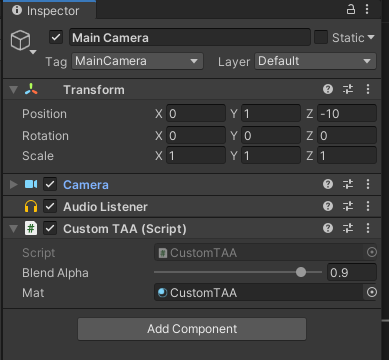
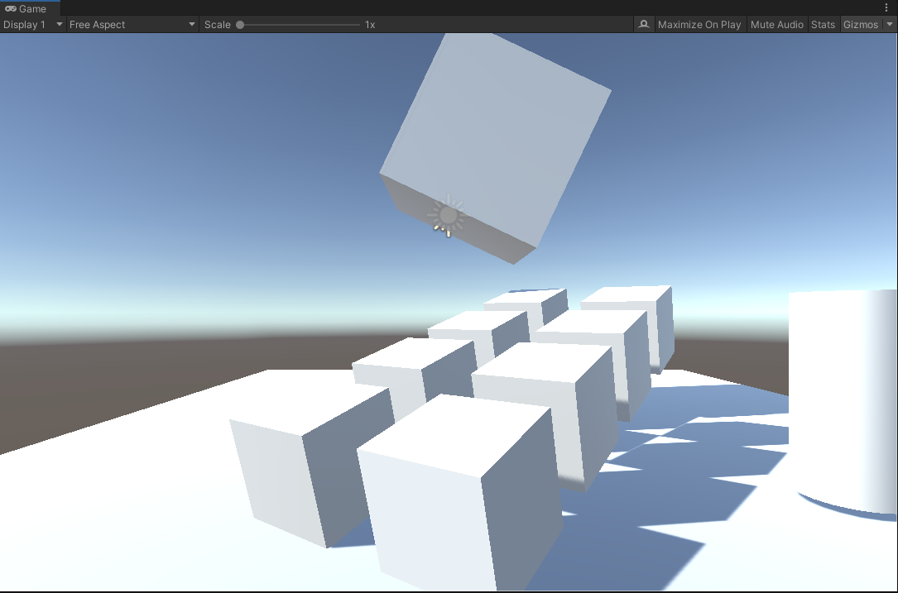
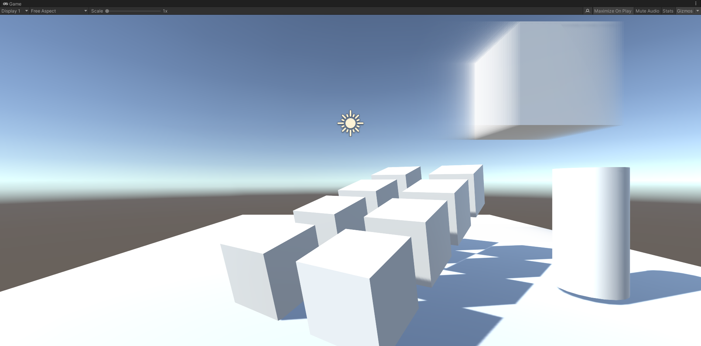
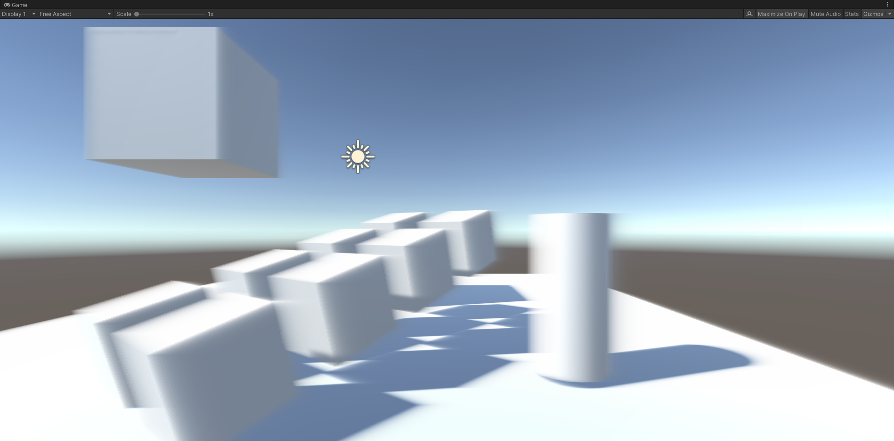
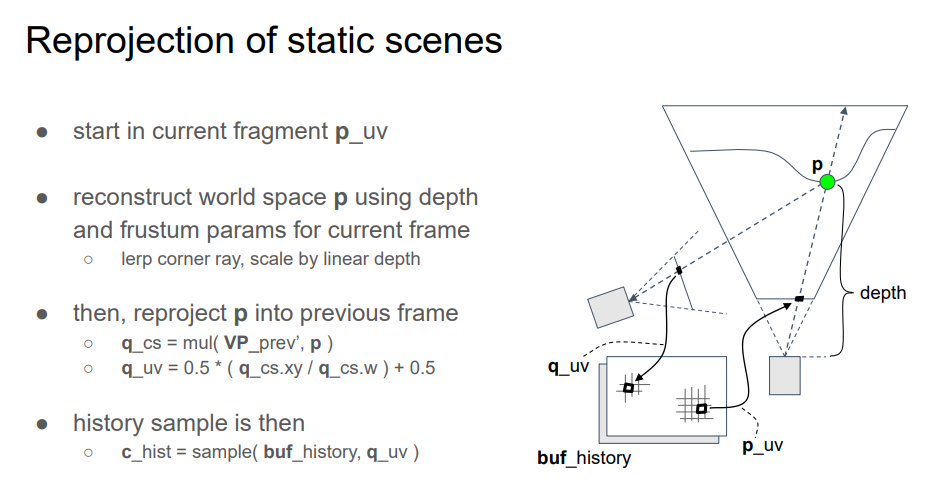
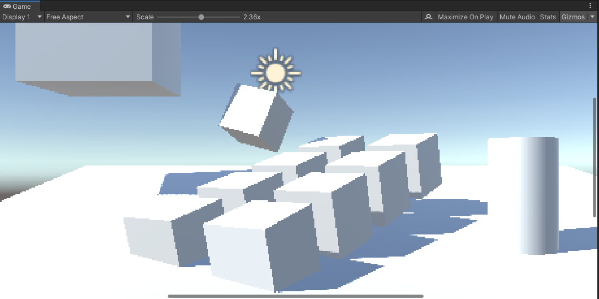
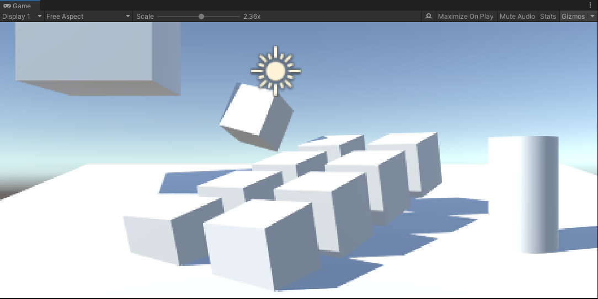
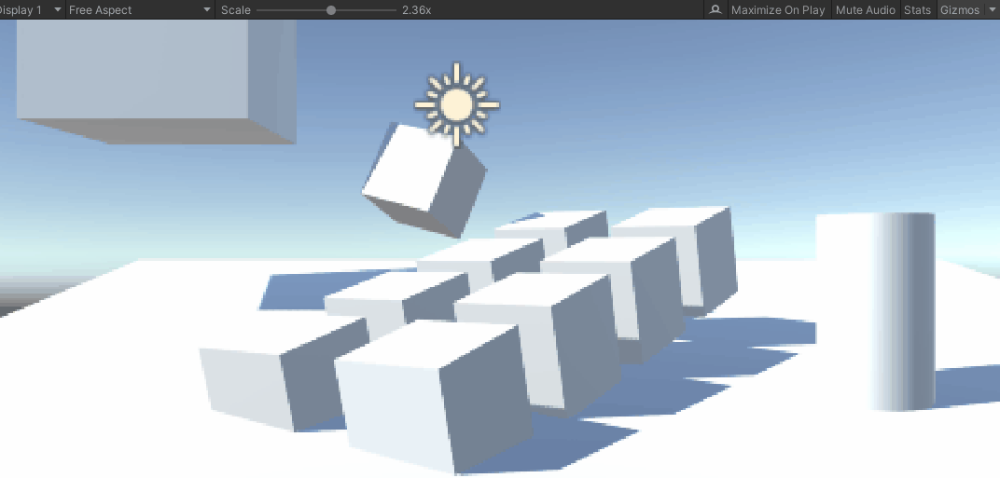

<!--more-->


# TAA基础步骤

1. 每帧绘制前jitter一下主相机的投影矩阵
2. 每帧做一个TAA后处理：将历史帧和当前帧混合

## jitter

所谓jitter就是说抖动一下相机视椎体位置（整体平移，但长宽不变），实现每帧绘制不同的子像素，实现多重采样。

每帧x、y方向抖动多少距离，不是完全随机的，而是要弄一个低差异序列。算出offset后，需要应用到投影矩阵，具体的数学原理看下面的文章：

[线性代数之透视矩阵Perspective Matrix](https://www.qiujiawei.com/linear-algebra-12/)

jitter后，如果什么都不做，只是显示当前帧到screen，会发现什么变化都没有，该锯齿还是锯齿（但这种子像素抖动不会导致整个屏幕抖动，如果是静态场景渲染，画面还是静止的）。

在Unity中做jitter，只需要**在OnPreCull里修改Camera.main.projectionMatrix**，以下算法来自UE4：

```c#

public class CustomTAA : MonoBehaviour
{
    float Halton(uint Index, uint Base)
    {
        float Result = 0.0f;
        float InvBase = 1.0f / Base;
        float Fraction = InvBase;
        while (Index > 0)
        {
            Result += (Index % Base) * Fraction;
            Index /= Base;
            Fraction *= InvBase;
        }
        return Result;
    }

    private void OnPreCull()
    {
        float u1 = Halton(frame_index + 1, 2);
        float u2 = Halton(frame_index + 1, 3);
        frame_index += 1;
        float Sigma = 0.47f;
        
        float OutWindow = 0.5f;
        float InWindow = (float)Math.Exp(-0.5 * Math.Pow(OutWindow / Sigma, 2));

        float Theta = 2.0f * (float)Math.PI * u2;
        float r = Sigma * (float)Math.Sqrt((float)(-2.0f * Math.Log((float)((1.0f - u1) * InWindow + u1))));  // r < 0.5

        float SampleX = r * (float)Math.Cos((double)Theta);
        float SampleY = r * (float)Math.Sin((double)Theta);

        float x = SampleX * 2.0f / Camera.main.pixelWidth;
        float y = SampleY * 2.0f / Camera.main.pixelHeight;


        Camera.main.ResetProjectionMatrix();
        var m = Camera.main.projectionMatrix;
        m.m02 += x;
        m.m12 += y;
        Camera.main.projectionMatrix = m;
    }  
}
```

其中的SampleX和SampleY下文还会用到，它们的单位是像素。

将这个CustomTAA脚本挂到Camera对象即可。

## 历史帧混合

上面jitter步骤只是影响了投影矩阵。但如果将当前帧图像缓存起来，变成历史帧纹理，那么下一帧就可以读取这个历史帧进行混合渲染。

这个步骤也很简单，先在脚本里添加OnRenderImage函数：

```c#
public class CustomTAA : MonoBehaviour
{
    [Range(0.0001f, 0.9999f)]
    public float blendAlpha = 0.9f;
    RenderTexture history_rt, temp_rt;
    bool firstFrame = true;
    uint frame_index = 0;
    [SerializeField]
    Material mat;

    private void OnRenderImage(RenderTexture source, RenderTexture destination)
    {
        if (firstFrame)
        {
            history_rt = new RenderTexture(Screen.width, Screen.height, 0, RenderTextureFormat.ARGBHalf);
            history_rt.dimension = UnityEngine.Rendering.TextureDimension.Tex2D;
            history_rt.Create();
            temp_rt = new RenderTexture(history_rt);
            temp_rt.Create();
            Graphics.Blit(source, history_rt);
            Graphics.Blit(source, destination);
            firstFrame = false;
        }
        else
        {
            if (mat == null)
                Graphics.Blit(source, destination);
            else
            {
                mat.SetTexture("_HistoryTex", history_rt);
                mat.SetTexture("_CurrentTex", source);
                mat.SetFloat("_BlendAlpha", blendAlpha);
                // 这里需要一个temp_rt是因为，如果只有一个history_rt
                // 那么就无法实现采样history_rt的同时，写入history_rt Blit会异常
                Graphics.Blit(source, temp_rt, mat);
                Graphics.Blit(temp_rt, history_rt);
                Graphics.Blit(temp_rt, destination);
            }
        }
    }
}
```

完整的shader代码：

```c
Shader "Custom/CustomTAA"
{
	Properties
	{
	}

	CGINCLUDE
	#pragma only_renderers ps4 xboxone d3d11 d3d9 xbox360 opengl glcore gles3 metal vulkan
	#pragma target 3.0


	#include "UnityCG.cginc"

	sampler2D _HistoryTex;
	sampler2D _CurrentTex;
	float _BlendAlpha;

	struct v2f
	{
		float4 cs_pos : SV_POSITION;
		float2 uv : TEXCOORD0;
	};

	v2f vert(appdata_img IN)
	{
		v2f OUT;
		OUT.cs_pos = UnityObjectToClipPos(IN.vertex);
		OUT.uv = IN.texcoord.xy;
		return OUT;
	}

	fixed4 frag(v2f i) : SV_Target
	{
		fixed4 c = tex2D(_CurrentTex, i.uv);
		fixed4 h = tex2D(_HistoryTex, i.uv);
		return lerp(c, h, _BlendAlpha);
	}
    ENDCG

	SubShader
	{
		ZTest Always Cull Off ZWrite Off
		Fog{ Mode off }

		Pass
		{
			CGPROGRAM

			#pragma vertex vert
			#pragma fragment frag

			ENDCG
		}
	}

	Fallback off
}

```

创建对应的材质并绑定：



结果如下：



（no TAA）


（after TAA）

其实这就是后处理了，都是Blit操作。

其中要注意的是，混合alpha太低的话，即使是静态场景+固定相机，画面也会剧烈抖动。

# TAA的第一个问题-ghosting

拖动场景中的方块，会出现这样的效果（为了让ghosting更明显，blend alpha设到0.9，即历史帧占比90%）：




不移动方块，只移动相机，会出现全屏ghosting：



# ghosting的应对方法-Reprojection

ghosting是因为物体运动或者相机运动产生的。运动导致采样错了历史帧的像素。那么如何知道当前像素在历史帧里的坐标（对应像素）呢？

假设一种简单的情况：**场景里只有相机运动，且当前帧的模型的所有像素，都能在历史帧里找到对应的像素**。

找对应像素的思路如下（用倒推的方式表达）：

1. 假设物体上的一点P在当前帧的光栅化uv坐标是p，在上一帧的uv坐标是q
2. 那么用q去采样历史帧，就能拿到正确的采样值
3. 为了算q，需要在CPU端记录上一帧的VP矩阵：previousViewProjectionMatrix
4. 有了PreVP还不行，还需要P点的世界坐标worldPos（注意，worldPos是不变的，因为我们假设了只有相机运动），可以用当前帧的深度buffer（TAA是一个后处理，必然有深度buffer），还原P点的世界坐标

示意图：



（INSIDE TAA)

第4步用depth计算worldPos，在defer渲染框架下是非必须的，因为GBuffer一般会输出worldPos。

unity中根据深度buffer算world pos的shader代码：

```c++
float rawDepth = SAMPLE_DEPTH_TEXTURE(_CameraDepthTexture, i.uv); // current frame depth
float4 cs = float4(i.uv.x*2.0 - 1.0, (i.uv.y)*2.0 - 1.0, rawDepth, 1.0); // current frame clip space
float4 ws = mul(_InvViewProjMatrix, cs);
ws /= ws.w;
```

非unity环境，上面的代码可能是不一样的，可以用一个pass输出world pos贴图（RGBFloat格式），即GBuffer，然后和上面的从深度重建的world pos算一个距离distance，如果全屏都是黑色的，那就没错了。

然后就是用world pos和上一帧的VP矩阵，手动算出UV坐标（即光栅化阶段的输出）。

```c++
float4 cs = mul(_PreviousViewProjection, float4(ws.xyz, 1)); // prev frame clip space
float4 ndc = cs / cs.w; // prev frame ndc
float2 uv = ndc.xy * 0.5 + 0.5; // prev frame uv
```

到了这里有个大坑是，这个算出来的uv是用当前帧有jitter的uv的算的，需要先减去当前帧的jitter，然后补回上一帧的jitter，才是上一帧对应的uv。然后就可以采样上一帧的画面，做混合了：

```c++
float4 c = tex2D(_CurrentTex, i.uv);
float4 h = tex2D(_HistoryTex, uv + _JitterUV.zw - _JitterUV.xy);
float4 to_screen = lerp(c, h, _BlendAlpha);
```


float4 _JitterUV里存了当前帧和上一帧的uv jitter距离，_JitterUV需要在TAA Pass前更新：

```c++
public Vector4 activeSample = Vector4.zero;

// update before frame draw：
activeSample.z = activeSample.x;
activeSample.w = activeSample.y;
activeSample.x = SampleX;
activeSample.y = SampleY;

// convert activeSample to uv space
Vector4 jitterUV = activeSample;
jitterUV.x /= source.width;
jitterUV.y /= source.height;
jitterUV.z /= source.width;
jitterUV.w /= source.height;
mat.SetVector("_JitterUV", jitterUV);
```

效果如下：




(No AA)



(Simple TAA)



(ghosting reduced)

# 更好的做法-速度图

上面假设了非常简单的情况：**当前帧的模型的所有像素，都能在历史帧里找到对应的像素**，然而这是很难的，比如说相机在当前帧拍到了模型的像素A，但在上一帧里这个A点还在屏幕外、或者A点被模型自身遮挡了、 被别的物体遮挡了、物体运动了。

先考虑物体自身运动+相机运动的情况。

VelocityBuffer存了像素位置变化向量。