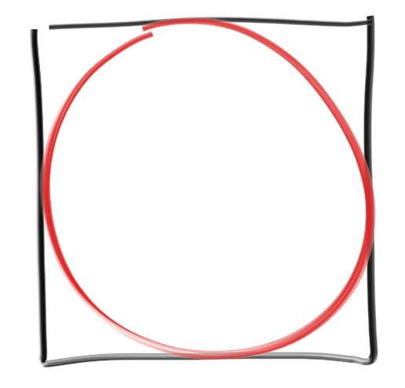
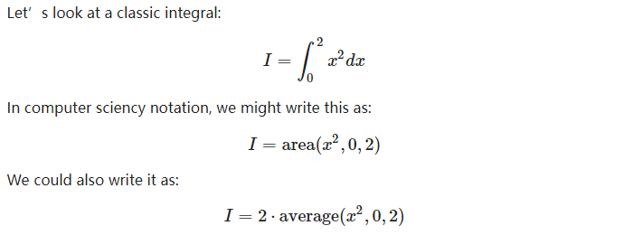

<!--more-->

本文是 [Ray Tracing: The Rest of Your Life](https://raytracing.github.io/books/RayTracingTheRestOfYourLife.html#mcintegrationonthesphereofdirections) 的学习总结。

# 用撒点法估算PI的值

正方形和正方形内接圆的面积比是固定的：




于是PI的值等于内接圆面积占比乘以4。

内接圆面积未知（不能用公式哦，PI是未知数），但根据圆的定义和半径，可以判定正方形内任意一点是不是在圆内，于是可以用撒点法估算圆面积占比。撒的点必然在正方形内，所以分母是撒点总数；点是否在圆内，需要算一下点到圆边距离是否小于半径，在圆内的点的数量作为分子，就可以估算面积比了。

```python
import random

def random_range(minv, maxv):
	return minv + random.random() * (maxv - minv)

def main():
	N = 10000
	inside_circle = 0
	for _ in xrange(N):
		x, y = random_range(-1.0, 1.0), random_range(-1.0, 1.0)
		if x*x + y*y < 1.0:
			inside_circle += 1
	print "Estimate of Pi = ", 4.0 * inside_circle / float(N)

main()
# Estimate of Pi =  3.144
```

## Law of Diminishing Returns 边际收益递减规律

上面的代码里N的值越大，估算的PI越准。但是随着撒的点越来越多，后面撒的点对PI的估算值的影响越来越小，也就是说前面撒的点对估算值影响会更大一些。价值是不等的。

## Stratified Samples (Jittering) 分层样本

（学过TAA技术的话，对jitter就很熟悉了。）

上面的代码里样本是全随机分布的，如果不采取全随机，而是用别的分布方式，是不是可以使得收敛速度加快呢？答案是肯定的。

```python
def main():
	sqrt_N = 1000
	inside_circle = 0
	inside_circle_stratified = 0
	for i in xrange(sqrt_N):
		for j in xrange(sqrt_N):
			x, y = random_range(-1.0, 1.0), random_range(-1.0, 1.0)
			if x*x + y*y < 1.0:
				inside_circle += 1
			  
			x = 2.0 * ((i + random_range()) / sqrt_N) - 1
			y = 2.0 * ((j + random_range()) / sqrt_N) - 1
			if x*x + y*y < 1.0:
				inside_circle_stratified += 1

	print "Estimate of Pi = ", 4.0 * inside_circle / float(sqrt_N * sqrt_N)
	
	print "Stratified Estimate of Pi = ", 4.0 * inside_circle_stratified / float(sqrt_N * sqrt_N)

#Estimate of Pi =  3.142428
#Stratified Estimate of Pi =  3.141412
```

可以看到，同样数量样本，分层的结果优于全随机的结果。意味着收敛速度也是更优的。

but，这个优势会随着维度的增加而递减，例如把上面的代码应用到3D的球和正方体，用体积占比算PI。(维度的诅咒)

分层样本对面下面的蒙特卡罗积分影响不大。

## x平方的定积分



众所周知，积分等于函数下方面积，所以第一和第二条式子等价没问题。

第三条式子需要复习下这篇资料：[Average Value of a Function](https://www.sfu.ca/math-coursenotes/Math%20158%20Course%20Notes/sec_avgval-area.html)

即积分等于平均值乘以上下界之差。

第三条公式直接翻译成代码，验证一下：

```python
def main():
	N = 100000

	sum = 0.0
	for i in range(N):
		x = random_range(0.0, 2.0)
		sum += x * x
	
	print 'I=', 2 * sum / float(N)

# I= 2.6686846395
```

手动推导x的平方的定积分，可以得到 8 / 3 = 2.666667，和上面代码的结果一致。

当定义域不是[0,2]，而是任意的[a,b]时：

```python
def main(a, b):
	N = 100000

	sum = 0.0
	for i in range(N):
		x = random_range(a, b)
		sum += x * x
	
	print 'I=', (b - a) * sum / float(N)

main(5, 10)

#I= 291.390411702
```

根据解析式算定积分验证一下：

```python
10 ** 3 / 3.0 - 5 ** 3 / 3.0 = 291.66666666666663
```

也是正确的。

## 概率密度函数、重要性采样

### 概率密度函数

概率密度函数有小p(X)和大P(X)之分，小p(X)描述的是一个随机变量为X的概率，大P(X)描述的是一个随机变量落在某个区间[−∞,X]的概率（对小p的积分）。

### 均匀分布概率密度函数

假设连续随机变量X在定义域[a,b]均匀分布(uniform)，那么小p等于1/(b - a)；大P(b)为1，P(a)为0。但对于球面坐标等多维度空间时，不一定是这样的式子。

### 非均匀分布概率密度函数

当X不是均匀分布时，这类分布称为non uniform。小p不再是一个常量，例如小p可能与X相关；而相应的大P依然还是取决于小p。

### 小p解析式积分算大P

当小p有解析式时，算它的积分式就是大P了。

例如当小p等于x/2时，大P为：

\\[ P = \frac\{x\^2}\{4\} \\]

### 大P的逆与蒙特卡罗积分

有了大P有什么用呢？可以用它来实现一个**满足小p的随机数生成器，这个随机数可以用于蒙特卡罗积分**！

我们知道大P是一个概率，值域是[0,1]，而随机数生成器一般都是用单位化的[0,1]，例如python的random.random()，和大P的取值范围一致！

如果把随机范围为[0,1]的均匀随机数生成器设为g，并设f(g)为经过某种映射的另一个**非均匀**随机数生成器，当f生成的随机数落在[a,b]区间、且概率分布满足小p时，那么有：

\\[ f(P(x)) = x \\]

验证边界情况是否符合：

\\[ f(P(b)) = f(1.0) = b \\]

\\[ f(P(a) = f(0.0) = a \\]

（这个式子好像很难解释，只能意会）

接着可以根据大P得到f的公式：

\\[ f(x) = P\^{-1}(x) \\]

f是P的逆函数。

以上面的例子，算出f：

\\[ P = \frac\{x\^2}\{4\} \\]

\\[ f = \sqrt{4P} = \sqrt{4g} \\]

在使用蒙特卡罗积分迭代计算时，会生成g，于是f也就有了，也意味着满足小p分布的随机数有了。

用f和大P，就可以做完整个蒙特卡罗积分。


### 重要性采样

蒙特卡罗积分不一定需要pdf，但用了pdf的蒙特卡罗积分会更好。

融入pdf后，可以对样本分布更多的区间，设置更低的采样权重。反比关系。

重点要理解的是，**样本的分布方式不会影响蒙特卡罗积分的结果**。例如以下算x的平方积分的蒙特卡罗积分代码，用了2种不同的pdf，但结果是一样的：

```python

def non_uniform_pdf():
	def pdf(x):
		return 0.5 * x # 小p
	N = 100000
	sum = 0.0
	for _ in range(N):
		x = math.sqrt(random_range(0.0, 4.0)) #根据小p推导出来的随机公式
		sum += x * x / pdf(x)
	
	print 'non_uniform_pdf I=', sum / float(N)

def uniform_pdf():
	def pdf(x):
		return 0.5 # 小p = 1/(b - a) = 1/(2.0 - 0.0) = 0.5
	N = 100000
	sum = 0.0
	for _ in range(N):
		x = random_range(0.0, 2.0) # 均匀分布，和main一样纯随机
		sum += x * x / pdf(x)
	
	print 'uniform_pdf I=', sum / float(N)


non_uniform_pdf()

uniform_pdf()

#non_uniform_pdf I= 2.67219787915
#uniform_pdf I= 2.66518526348

```


用non uniform的pdf分布做蒙特卡罗积分，这就是图形学中所谓的**重要性采样**了。

上面代码里的non uniform pdf也可以是别的，甚至可以和被积函数x平方几乎一样：

\\[ p(x) = \frac\{3}{8}x\^{2} \\]

积分得到大P：

\\[ P(x) = \frac\{x\^{3}}{8} \\]

取逆：

\\[ P\^{-1}(x) = (8x)\^{\frac{1}{3}} \\]


代码和结果如下：

```python
def non_uniform_pdf2():
	def pdf(x):
		return 3*x*x/8
	N = 100000
	sum = 0.0
	for _ in range(N):
		x = pow(random_range(0, 8.0), 1.0/3.0)
		sum += x * x / pdf(x)
	
	print 'non_uniform_pdf2 I=', sum / float(N)

#non_uniform_pdf2 I= 2.66666666666
```


小结一下:

- 对整个小p的定义域做积分，结果需要等于1（面积等于概率，总面积即100%概率）。
- pdf公式越接近目标积分式，则收敛速度越快。

### 如果定积分范围变了呢

还是上面的x平方求积分的例子，但如果改变定积分范围，从[0,2]改成[0,1]，再次用蒙特卡罗积分+pdf求解时，pdf是要**同步更新**的，例如还是用uniform pdf：

```python
def uniform_pdf():
	def pdf(x):
		return 1.0 # 1.0 / ( 1.0 - 0.0) = 1.0
	N = 100000
	sum = 0.0
	for _ in range(N):
		x = random_range(0.0, 1.0)
		sum += x * x / pdf(x)
	
	print 'uniform_pdf I=', sum / float(N)
	print 'x^3/3 =', 1.0 ** 3/3.0

#uniform_pdf I= 0.333199982803
#x^3/3 = 0.333333333333
```

### pdf是否可以大于1？

是可以大于1的：

```python
def uniform_pdf():
	def pdf(x):
		return 2.0 # 1.0 / ( 0.5 - 0.0) = 2.0
	N = 100000
	sum = 0.0
	for _ in range(N):
		x = random_range(0.0, 0.5)
		sum += x * x / pdf(x)
	
	print 'uniform_pdf I=', sum / float(N)
	print 'x^3/3 =', 0.5 ** 3/3.0

#uniform_pdf I= 0.0418766074159
#x^3/3 = 0.0416666666667
```

### pdf是否可以小于0？

pdf不可能小于0，因为定积分上界减上界必然是正数。


## 球面蒙特卡罗积分

以单位球心为原点，往球面发射任意光线，因为是全随机，那么任意方向的概率密度是一样的，即小p是常量，等于1/球面面积，即1/(4π)。

假设有一个要积分的函数：

\\[ \int cos\^{2}(\theta ) \\]

要对整个球面做蒙特卡罗积分，小p已有，大P没有，但其实大P是不需要的，因为限定了是均匀分布。

但被积函数使用的是球极坐标，首先要把完整的式子写出来：


\\[ \\int\_\{0\}\^\{2\pi\} \\int\_\{0\}\^\{\pi\}   cos\^{2}(\theta ) sin\theta d\theta d\phi \\]

先算出积分结果，方便验证。打开[Integral Calculator](https://www.integral-calculator.com/)，输入被积函数，得到：

\\[ F = -\frac {cos\^ 3(x)}{3} \\]

代入定积分上下界，得到：

\\[(2\pi - 0) (-\frac {cos\^ 3(\pi )}{3}  - (-\frac {cos\^ 3(0)}{3}) ) \\]

\\[ = 2\pi (-\frac {-1\^ 3}{3}  + \frac {1}{3} ) \\]


\\[ = 2\pi  (\frac {1}{3}  + \frac {1}{3} ) \\]


\\[ = \frac {4\pi }{3} \\]

用蒙特卡罗和pdf求解的代码如下：

```python
def sphere():
	def pdf(d):
		return 1.0 / (4.0 * math.pi)
	N = 1000000
	sum = 0.0
	for _ in range(N):
		d = random_unit_vector()
		cosine_squared = d[2] * d[2]
		sum += cosine_squared / pdf(d)
	print "sphere I = ", sum / float(N) 
	print "sphere 4 * pi /3 = ", math.pi * 4.0 / 3.0 

	
sphere()
#sphere I =  4.18595873614        
#sphere 4 * pi /3 =  4.18879020479
```


