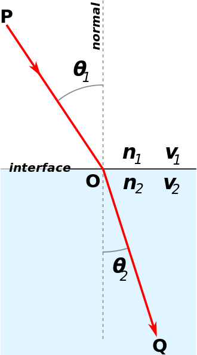

<!--more-->

# 为什么叫路径追踪[Path tracing](https://en.wikipedia.org/wiki/Path_tracing)

最暴力的光线追踪算法，是对第一个intersection point，都发射出大量的随机方向光线（每一条光线又会产生大量递归光线），所有光线返回的radiance加权平均就是该点的radiance。

这样需要发射的光线太多，计算量太大。

而路径追踪，从屏幕像素出发的光线**不会分裂**，当然代价就是噪声会很大，有多种降噪方法，一种是从屏幕像素发射不止1条光线而是N条（每条依然不分裂），然后算平均值；一种是用类似TAA的temporal filter方法，
每一帧做次像素jitter，并混合历史帧实现超采样。

# 双向路径追踪

这是一种更高效的路径追踪算法。包括了两方面：

- Backwards Path Tracing。从屏幕射出光线，到达光源时终止。
- Light Tracing (or Forwards Path Tracing)。从光源射出光线，到达屏幕时终止。

# 算法关键点

## 用俄罗斯轮盘赌算法（Russian Roulette）终止递归

先复习一个概念：数学期望E。

数学期望是指，每次可能的结果乘以其结果概率的总和。

例如丢骰子游戏，每个面出现的概率是1/6，那么丢出来的结果数学期望是多少呢？

\\[ E\(X\) = 1 \cdot \frac\{1\}\{6\} + 2 \cdot \frac\{1\}\{6\} + 3 \cdot \frac\{1\}\{6\} + 4 \cdot \frac\{1\}\{6\} + 5 \cdot \frac\{1\}\{6\} + 6 \cdot \frac\{1\}\{6\} = 3.5 \\]

在路径追踪中计算Radiance时，需要算每个intersection point的Radiance，实际上算的也只是Radiance的数学期望，假设Radiance的取值只有两种：Lo或者0，Lo是指继续沿着光线路径，追踪得到的Radiance值；而0则是**终止追踪**返回的值（纯黑色）。设继续追踪的概率为P，终止追踪的概率为1-P。

于是Radiance的数学期望为：

\\[ E = Lo  \cdot P +  0 \cdot (1 - P) = Lo \cdot P \\]

可以看到，E和Lo不等，且比值为P。这个P可以巧妙地干掉，只需要改下公式：

\\[ E =  \frac\{Lo\}\{P\}   \cdot P +  0 \cdot (1 - P) = Lo \\]

因为P是递归的概率，只要P小于1，那么就不可能无限递归。

## 光源远或面积过小时，采样不足

均匀随机的光线，很难命中过小的光源，就会产生很强烈的噪点。解决该问题的办法叫**emitter sampling**，即从intersection point直接发射一条到光源的光线。因为光源有面积，所以目标点不是光源原点，而是需要在光源面积范围上随机出一个目标点，从而得到随机化的光线方向。

## 光源被遮挡问题

上面说的emitter sampling，是假设了intersection point和光源之间无遮挡。如果存在遮挡，那么不应该直接采样获得光源的Radiance。为了避免这个问题，需要搜索下BVH，判断是否有遮挡，有的话终止。

## 重要性采样

在一些简单的光线追踪代码中，一般只实现了diffuse材质，并且声明实现了Cosine importance sampling。其实对于diffuse材质来说，重要性采样就是cos，方向越接近法线，cos就越大，采样率应该越底。所以他们这个feature很简单就加上了。。

## 材质问题

### BSDF、BRDF、BTDF

BSDF 是 BRDF和BTDF的统称。

### 材质分类

基本材质类型:

- 粗糙材质（LambertianDiffuse）
- 镜面材质（Mirror）
- 电介材质（Dielectric/Glass） 

高级材质：

- 粗糙导体（RoughConductor)
- 粗糙电介质（RoughDielectric)
- 迪士尼材质（Disney）

### 电介材质问题

#### 折射率 Refractive index （IOR）

折射率描述了光在电介质中的速度和真空里的速度的比值。

例如水是1.333，表示光在真空的速度比在水里的速度快1.33倍；玻璃则是1.5。

#### 斯涅尔定律Snell's Law 和全内反射Total Internal Reflection

斯涅尔定律是用来算光经过不同介质时的折射方向的，前提是知道2个介质的折射率。

\\[ η⋅sinθ=η′⋅sinθ′ \\]

η、η′、sinθ是已知信息，sinθ′是要求的值。变换下上式：

\\[ sinθ′=\frac {η}{η′}⋅sinθ \\]

全内反射：当光线经过两个不同折射率的介质时，部分的光线会于介质的界面被折射，其余的则被反射。但是，当入射角比临界角大时（光线远离法线），光线会停止进入另一界面，全部向内面反射。

根据上面的公式可以理解这个问题，当η大于η'时，\\( \frac {η}{η′}⋅sinθ \\) 可能会大于1，而sin取值范围是[-1,1]，这就导致了sinθ′无解。

于是就有了一个叫**临界角**的概念，当θ大于临界角时，光只能反射而不能折射。临界角的计算推导：

假设\\( θ\_\{c}  \\)是临界角，那么有：

\\[ \frac {η}{η′}⋅sinθ\_\{c}  = 1 \\]

转换一下位置：

\\[ sinθ\_\{c}  = \frac {η′}{η} \\]

\\[  θ\_\{c}   = arcsin(\frac {η′}{η}) \\]

当实现电介材质（水、玻璃）时，需要考虑全内反射问题。

#### 菲涅耳反射率 Fresnel Reflectance

上面只解决了光通过电介质时的折射方向，但是究竟多少能量被折射（以及剩下多少能量反射），是不知道的。

假定折射率为x，那么根据能量守恒可以知道反射率为1-x。

折射率一般用近似公式算([Schlick's approximation](https://en.wikipedia.org/wiki/Schlick%27s_approximation))。

#### 用俄罗斯轮盘赌算法（Russian Roulette）算期望

这里用这个轮盘赌可以理解成减少光线分裂数。这是因为光经过不同介质时，只要不是全内反射，那么必然会分裂成2个光线，假设整个场景都是各种电介质，那么path tracing跑一遍就很慢了。

于是要引入轮盘赌：要么折射要么反射，没有光线分裂。并且利用了除以P的技巧，使得能量守恒。

