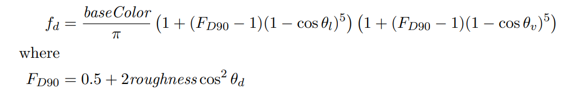

<!--more-->


## Lambertian Diffuse

例如假设有一束光达到一个白色木板上，并且该白色木板不吸收热辐射，那么白色木板应该反射多少光（能量）出去？显然是100%，因为假定了白色木板不吸收能量，并且木板也不是电介质，没有产生折射，
光必然100%反射到各个方向去了。此时BSDF是多少呢？这就要看白色模板的材质。

假设白色木板是用的Lambertian Diffuse材质，即一束光会均匀地散射到所有方向。

直接搬出Lambertian Diffuse BSDF公式：

\\[ f = \\frac {ρ\_{albedo}}{\pi } \\]

其中的\\(ρ\_{albedo}\\)是指diffuse物体的**反射率**。

这个其实就是3D模型基本都会有的albedo纹理，是同个东西。例如如果给白色木板画个纹理，那就是一张纯白色的图片，反射率为(1.0, 1.0, 1.0)，表示打到木板上的光线全部反射，不吸收。

当albedo不等于(1.0, 1.0, 1.0)时，例如(0.5, 0.5, 0.5)，说明木板吸收了光束一半的辐射；当albedo等于(0,0,0)时，木板完全不反射，光的能量全部吸收掉。

至于为什么要除以π才是diffuse物体的BSDF，得从渲染方程说起。

（在我的这篇 [渲染基础理论的介绍](https://www.qiujiawei.com/rendering-equation/) 文章中有介绍相关的公式推导 ）

先看下wiki里的渲染方程：


这公式是在说，已知出射方向\\(w\_o\\)，那么把被渲染的点(shading point)自身沿着\\(w\_o\\)方向发射的radiance部分、以及接收到的radiance并且要反射出去的部分，通通加起来，就是总共的要沿着\\(w\_o\\)发射出去的radiance。

再看我的无伤大雅的简化版（去掉了波长变量以及时间变量）：

\\[ L\_\{o\}(p, \omega \_\{o\}) = L\_\{e\}(p, \omega \_\{o\})  + \\int \_\{\Omega \}f(p, \omega \_\{o\}, \omega \_\{i\}) L\_\{i\}(p, \omega \_\{i\}) |cos \theta \_\{i\}|d\omega \_\{i\} \\]

因为现在讨论的是diffuse材质，没有自发光，可以去掉自发光项；另外把公式改成用spherical angle表达（需要一点[立体角](http://127.0.0.1:4000/solid-angle/)的知识），结果如下：

\\[ L\_\{o\} = \\int \_\{0 \}\^\{ 2π \} \\int \_\{0 \}\^\{ \\frac \{π\}\{2\} \} f(p, \\theta ,\\phi ) L\_\{i\} (p,\\theta ,\\phi ) cos\\theta sin\\theta d\\theta d\\phi \\]

再因为diffuse材质会吧把收到的光线均匀地散射出去，即\\(L\_i\\)不影响后面的反射，同时因为均匀性，f也是个常数，所以右边的积分里，可以把\\(L\_i\\)、f当成常量提到外面去，只关注剩下的积分式：

\\[  \\int \_\{0 \}\^\{ 2π \} \\int \_\{0 \}\^\{ \\frac \{π\}\{2\} \}   cos\\theta sin\\theta d\\theta d\\phi \\]

这是个可以算出来的式子，结果等于π。于是有：


\\[ L\_\{o\} =  L\_\{i\} \cdot f \cdot π \\]

因为能量要守恒，所以 f必须等于 \\( \frac {1}{\pi } \\)。但在渲染里既然要模拟光被吸收，使得物体呈现不同的颜色，能量应该是允许不守恒的，那么f应该等于多少呢？答案在上文其实已经给出了：

\\[ f = \\frac {ρ\_{albedo}}{\pi } \\]

再搬出那块白色木板，它百分百反射所有光，\\(ρ\_{albedo} \\)为1，所以它的f为 \\( \frac {1}{\pi } \\)。


（这篇文章也很好地解释了diffuse BSDF公式的推导：
[Deriving Lambertian BRDF from first principles](https://sakibsaikia.github.io/graphics/2019/09/10/Deriving-Lambertian-BRDF-From-First-Principles.html) ）


## 非Lambertian Diffuse

Lambertian Diffuse直接认为Diffuse材质时完全均匀反射所有光线，然而这个假设过于笼统了。Disney研究了现实世界Diffuse材质后发现，可以用一种更复杂的公式模拟Diffuse，使得Diffuse材质更真实。

它的公式如下：



(from disney的论文)

其中\\(\theta \_l \\)和\\(\theta \_v \\)分别是光线l、视线v与法线n的夹角，\\(\theta \_d \\)是光线l和半程向量h的夹角（h一般为0.5*(v + l) ）。

baseColor就是上一节的\\(ρ\_{albedo} \\)，可见disney的这个公式还是没有脱离上一节的推导的，只是在Lambertian Diffuse的f后面加了一坨计算。


## 两种Diffuse的实现代码

第一份是从Filament里扒的：

```c++

float Fd_Lambert() {
    return 1.0 / PI;
}

float F_Schlick(float f0, float f90, float VoH) {
    return f0 + (f90 - f0) * pow5(1.0 - VoH);
}

float Fd_Burley(float roughness, float NoV, float NoL, float LoH) {
    // Burley 2012, "Physically-Based Shading at Disney"
    float f90 = 0.5 + 2.0 * roughness * LoH * LoH;
    float lightScatter = F_Schlick(1.0, f90, NoL);
    float viewScatter  = F_Schlick(1.0, f90, NoV);
    return lightScatter * viewScatter * (1.0 / PI);
}

float diffuse(float roughness, float NoV, float NoL, float LoH) {
#if BRDF_DIFFUSE == DIFFUSE_LAMBERT
    return Fd_Lambert();
#elif BRDF_DIFFUSE == DIFFUSE_BURLEY
    return Fd_Burley(roughness, NoV, NoL, LoH);
#endif
}

// diffuseLobe返回该像素点真正的diffuse color
// pixel.diffuseColor即albedo
vec3 diffuseLobe(const PixelParams pixel, float NoV, float NoL, float LoH) {
    return pixel.diffuseColor * diffuse(pixel.roughness, NoV, NoL, LoH);
}
```


这个是从知乎找的精简版：

```c++

float3 Diffuse_Burley_Disney( float3 albedo, float Roughness, float NoV, float NoL, float VoH ) 
{ 
       float FD90 = 0.5 + 2 * VoH * VoH * Roughness; 
       float FdV = 1 + (FD90 - 1) * Pow5( 1 - NoV ); 
       float FdL = 1 + (FD90 - 1) * Pow5( 1 - NoL ); 
       return albedo * ( (1 / PI) * FdV * FdL ); 
} 

```
