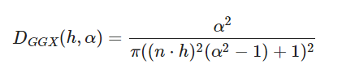
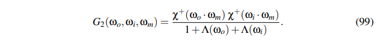
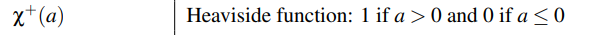
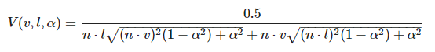
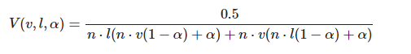

<!--more-->

很久前总结了pbr公式内容：[PBR渲染原理](https://www.qiujiawei.com/pbr-rendering/)，但没有说到各向异性的问题。

最近发现[Filament](https://google.github.io/filament/Filament.html)详细介绍了pbr相关的知识，也有源码可读，可以好好学习一番。

pbr理论中，高光项的公式如下：

\\[ f\_ r(v,l) = \\frac \{ D(h,\alpha ) G(v,l,\alpha ) F(v,h,F\_0) \} \{ 4 (n \cdot v)(n \cdot l) \} \\]


Filament用一个specularLobe统一描述了各向同性和各向异性的高光项：

```c++
vec3 specularLobe(const PixelParams pixel, const Light light, const vec3 h,
        float NoV, float NoL, float NoH, float LoH) {
#if defined(MATERIAL_HAS_ANISOTROPY)
    return anisotropicLobe(pixel, light, h, NoV, NoL, NoH, LoH);
#else
    return isotropicLobe(pixel, light, h, NoV, NoL, NoH, LoH);
#endif
}
```

本文的目标是理解这里面的代码。

# Filament的着色流程

代码都在shaders/src目录，根据宏变体，会组合这里面的代码，最终生成目标shader。

main.fs的main是入口:

```c++
void main() {
    filament_lodBias = frameUniforms.lodBias;

    // See shading_parameters.fs
    // Computes global variables we need to evaluate material and lighting
    computeShadingParams(); // 计算一些全局参数

    // Initialize the inputs to sensible default values, see material_inputs.fs
    MaterialInputs inputs;
    initMaterial(inputs); // 初始化默认值

    // Invoke user code
    material(inputs); //调用.mat文件里的用户代码

    fragColor = evaluateMaterial(inputs); // 着色
    ...
}
```

其中的evaluateMaterial具体是哪一个实现，得看选择的shading model。以基本的pbr为例（即LIT模型），代码在shading_lit.fs：

```c++
vec4 evaluateLights(const MaterialInputs material) {
    PixelParams pixel;
    getPixelParams(material, pixel); // 从材质参数转换得到后续计算用的PixelParams

    vec3 color = vec3(0.0);

    evaluateIBL(material, pixel, color); // 默认都有IBL间接光

#if defined(HAS_DIRECTIONAL_LIGHTING)
    evaluateDirectionalLight(material, pixel, color); // 下面会分析的重点接口
#endif

    ...

    return vec4(color, computeDiffuseAlpha(material.baseColor.a));
}

vec4 evaluateMaterial(const MaterialInputs material) {
    vec4 color = evaluateLights(material);
    addEmissive(material, color); // 自发光，先忽略
    return color;
}
```

然后就看evaluateDirectionalLight，代码在light_directional.fs：


```c++
void evaluateDirectionalLight(const MaterialInputs material,
        const PixelParams pixel, inout vec3 color) {

    Light light = getDirectionalLight();
    ...
    float visibility = 1.0;
#if defined(HAS_SHADOWING)
    //算阴影 得到visibility
    ...
#endif

#if defined(MATERIAL_HAS_CUSTOM_SURFACE_SHADING)
    color.rgb += customSurfaceShading(material, pixel, light, visibility);
#else
    color.rgb += surfaceShading(pixel, light, visibility); // 重点
#endif
}

```

surfaceShading的代码在shading_model_standard.fs，这个就已经是pbr的核心代码了。


# 几个材质关键参数的计算

MaterialInputs是用户端的参数，即给美术编辑用的：

```glsl
struct MaterialInputs {
    vec4  baseColor;
    float roughness;
    float metallic;
    float reflectance;
    float ior;
    ...
}
```

PixelParams存了每个着色点的基本系数，一般这些系数和具体的着色算法无关：

```glsl
struct PixelParams {
    vec3  diffuseColor;
    float perceptualRoughness;
    float perceptualRoughnessUnclamped;
    vec3  f0;
    float roughness;
    vec3  dfg;
    vec3  energyCompensation;
    ...
}
```

根据MaterialInputs计算PixelParams的代码，主要是算了pixel.diffuseColor和pixel.f0 ：


```glsl
vec3 computeDiffuseColor(const vec4 baseColor, float metallic) {
    return baseColor.rgb * (1.0 - metallic);
}

void getCommonPixelParams(const MaterialInputs material, inout PixelParams pixel) {
    vec4 baseColor = material.baseColor;
    pixel.diffuseColor = computeDiffuseColor(baseColor, material.metallic);

#if !defined(SHADING_MODEL_SUBSURFACE) && (!defined(MATERIAL_HAS_REFLECTANCE) && defined(MATERIAL_HAS_IOR))
    float reflectance = iorToF0(max(1.0, material.ior), 1.0);
#else
    // Assumes an interface from air to an IOR of 1.5 for dielectrics
    float reflectance = computeDielectricF0(material.reflectance);
#endif
    pixel.f0 = computeF0(baseColor, material.metallic, reflectance);

    ...
}
```

## pixel.diffuseColor 

从computeDiffuseColor可见，metallic越大，pixel.diffuseColor就越接近黑色，黑色即表示几乎没有漫反射光。

## pixel.f0 

首先是理解什么是F0, F0等于 **Fresnel Reflectance at 0 Degrees**，是一个介于0到1的数，它表示**当入射光线和表面垂直时，有x%的radiance变成镜面反射出去**（剩下的1-x%发生折射）。

为什么要知道F0呢，因为pbr计算过程中有一个费涅尔项F（Fresnel term），需要用到F0。

有几个重要知识点要记一下：

1. 电介质(dielectrics)的F0是非彩色的(achromatic)，即认为RGB各分量相等
2. 金属(metallic)的F0是彩色的(chromatic)，RGB分量不相等
3. F90必然等于1.0，F90表示当光线以grazing angles打到表面时，100%发生镜面反射，无论是电介质还是金属都一样
4. 一般来说，大部分电介质的F0是4%；水是2%；F0最高的电介质是宝石(gemstones)，16%左右。


### F0计算方法1

为了方便美术调节F0，于是业界大佬发明了映射公式：

\\[ f\_0 = 0.16 \cdot f\_\{linear\} \^2 \\]

\\(f\_\{linear\}\\)是个0到1的线性值，其中0.5对应水的F0（2%），1.0对应宝石的F0(16%)。Filament shader里的material.reflectance即是\\(f\_\{linear\}\\)，computeDielectricF0就是做这个映射的接口：

```glsl
float computeDielectricF0(float reflectance) {
    return 0.16 * reflectance * reflectance;
}
```

### F0计算方法2

另一种算法是基于材质的[ior](https://en.wikipedia.org/wiki/Refractive_index)。ior是指光穿过两种介质界面时的折射率，例如空气\\(\\rightarrow \\)水界面的ior是1.33。

ior也是一个给美术调节的系数，即Filament shader里的material.ior。

ior涉及到两种介质，但在游戏里一般其中一种介质是空气，因此可以认为，各种介质相对空气的ior，即为该介质的ior，记为\\(n\_\{ior\}\\)。空气的(n\_\{ior\}\\)即为1。

由ior算F0的公式如下：

\\[  f\_0 ( n\_\{ior\} ) =  ( \\frac \{n\_\{ior\} - 1\}\{n\_\{ior\} + 1\} ) \^2 \\]

这条公式不是随便拟合出的，是真实的物理公式简化得到的。详情可阅读：

- [Fresnel equations](https://en.wikipedia.org/wiki/Fresnel_equations)
 
- [Light at Interfaces](http://www1.udel.edu/chem/sneal/sln_tchng/CHEM620/CHEM620/Chi_4._Light_at_Interfaces.html#:~:text=For%20water%20and%20diamond%2C%20which,to%20see%20glass%20in%20air.)
 
涉及到极化性质什么的，就不细究了。

总之能简化成上述公式的原因是，\\(f\_\{0\}\\)描述的是垂直角度的反射率。

另外补充一下，当其中一种介质并不是空气时，此时也可以根据这两种介质相对空气的ior，来算\\(f\_\{0\}\\)，公式如下：


\\[  f\_0 = ( \\frac \{ n\_\{1\} - n\_\{2\} \}\{ n\_\{1\} + n\_\{2\} \} ) \^2 \\]

分子分母同时除以\\(n\_\{2\}\\)，就和前一条公式差不多了：

\\[  f\_0 = ( \\frac \{ \\frac \{n\_\{1\} \} \{ n\_\{2\} \} - 1 \}\{ \\frac \{n\_\{1\} \} \{ n\_\{2\} \} + 1 \} ) \^2 \\]

当\\(n\_\{2\}\\)为空气的ior 1.0时，就是第一条公式了。

Filament中的实现代码如下：

```glsl
float iorToF0(float transmittedIor, float incidentIor) {
    return sq((transmittedIor - incidentIor) / (transmittedIor + incidentIor));
}

```

transmittedIor即\\(n\_\{1\}\\)，incidentIor即\\(n\_\{2\}\\)。

调用代码：

```glsl
float reflectance = iorToF0(max(1.0, material.ior), 1.0);
```

可见，Filament直接约束了transmittedIor不低于1，且让incidentIor固定为空气ior 1.0。


### 根据material.metallic插值

上面算出来的\\(f\_\{0\}\\)是个标量（scalar）（非彩色），只限定于电介质，为了和金属材质统一起来，所以还需要根据材质的metallic（金属度），做插值：

```glsl
vec3 computeF0(const vec4 baseColor, float metallic, float reflectance) {
    return baseColor.rgb * metallic + (reflectance * (1.0 - metallic));
}

pixel.f0 = computeF0(baseColor, material.metallic, reflectance);
```

可见，金属度越高，pixel.f0越接近于材质属性里的baseColor（彩色）；金属度越低，越接近前面算出来的电介质reflectance（非彩色）。


# isotropic specular

先从各向同性开始：

```c++
vec3 isotropicLobe(const PixelParams pixel, const Light light, const vec3 h,
        float NoV, float NoL, float NoH, float LoH) {

    float D = distribution(pixel.roughness, NoH, h);
    float V = visibility(pixel.roughness, NoV, NoL);
    vec3  F = fresnel(pixel.f0, LoH);

    return (D * V) * F;
}
```
发现代码里少了\\( 4 (n \cdot v)(n \cdot l) \\)部分，这是因为Filament把specular公式拆成三部分：


\\[ f\_ r(v,l) = D(h,\alpha ) \cdot  \\frac \{  G(v,l,\alpha ) \} \{ 4 (n \cdot v)(n \cdot l) \}  \cdot F(v,h,F\_0) = D \cdot V \cdot F \\]


\\( 4 (n \cdot v)(n \cdot l) \\)被放进了V项中了。


## D项

Filament里只有GGX一种（说明够用）:



做一些变换，方便和代码对应：

\\[ D = \frac \{1\}\{\pi \} \cdot (\frac \{\alpha  \} \{ (n\cdot h)\^ 2(\alpha \^ 2 - 1) + 1 \})\^ 2 \\]

\\[  = \frac \{1\}\{\pi \}  (\frac \{\alpha  \} \{ (n\cdot h)\^ 2 \alpha \^ 2 - (n\cdot h)\^ 2 + 1 \})\^ 2 \\]

\\[  = \frac \{1\}\{\pi \}  (\frac \{\alpha  \} \{ ( (n\cdot h) \alpha) \^ 2 + (1 - (n\cdot h)\^ 2)  \})\^ 2 \\]

代码如下：

```glsl
float D_GGX(float roughness, float NoH, const vec3 h) {
    float oneMinusNoHSquared = 1.0 - NoH * NoH;
    float a = NoH * roughness;
    float k = roughness / (oneMinusNoHSquared + a * a);
    float d = k * k * (1.0 / PI);
    return saturateMediump(d);
}

float distribution(float roughness, float NoH, const vec3 h) {
#if BRDF_SPECULAR_D == SPECULAR_D_GGX
    return D_GGX(roughness, NoH, h);
#endif
}
```

## G项

G项的话，Filament用了这篇论文里的equation 99： [Understanding the Masking-Shadowing Function
in Microfacet-Based BRDFs](https://jcgt.org/published/0003/02/03/paper.pdf)。这条公式的好处推导相当复杂，直接用即可。



里面的符号的解释：

\\(\omega \_o\\), \\(\omega \_i\\), \\(\omega \_m\\)分别表示出射方向、入射方向、微平面法线方向。

\\(\chi \^+ \\) 是指heaviside function，也叫unit step function，单位阶跃函数，值要么是0要么是1。



因为specular只考虑反射光，所以出入射方向和微平面法线夹角小于180°，分子等于1。

另外因为\\( 4 (n \cdot v)(n \cdot l) \\)被合并到了G项里（所以就换了个名字叫V项）。

最终的V公式如下：




```glsl
float V_SmithGGXCorrelated(float roughness, float NoV, float NoL) {
    float a2 = roughness * roughness;
    float lambdaV = NoL * sqrt((NoV - a2 * NoV) * NoV + a2);
    float lambdaL = NoV * sqrt((NoL - a2 * NoL) * NoL + a2);
    float v = 0.5 / (lambdaV + lambdaL);
    return saturateMediump(v);
}
```

这里又有个经典技巧，牺牲精度换时间。因为开平方和平方操作都比较耗，直接干掉，公式变成：



这个只是近似公式，数学上是错的，但不用深究，用就是了。

```glsl
float V_SmithGGXCorrelated_Fast(float roughness, float NoV, float NoL) {
    /*
    float a = roughness;
    float GGXV = NoL * (NoV * (1.0 - a) + a);
    float GGXL = NoV * (NoL * (1.0 - a) + a);
    return 0.5 / (GGXV + GGXL);
    */
    float v = 0.5 / mix(2.0 * NoL * NoV, NoL + NoV, roughness);
    return saturateMediump(v);
}

float visibility(float roughness, float NoV, float NoL) {
#if BRDF_SPECULAR_V == SPECULAR_V_SMITH_GGX
    return V_SmithGGXCorrelated(roughness, NoV, NoL);
#elif BRDF_SPECULAR_V == SPECULAR_V_SMITH_GGX_FAST
    return V_SmithGGXCorrelated_Fast(roughness, NoV, NoL);
#endif
}
```


## F项


\\(f\_\{0\}\\)、\\(f\_\{90\}\\)上面已经分析过了，不再介绍。

当\\(f\_\{90\}\\)为1时，有以下等价公式：

\\[ f\_\{90\} = 1\\]

\\[ f = (1 - v\cdot h)\^ 5 \\]

\\[ F = f\_\{90\}(1 - v\cdot h)\^ 5 - f\_\{0\}( 1 - (1 - v\cdot h)\^ 5 ) \\]

\\[ = (1 - v\cdot h)\^ 5 - f\_\{0\}( 1 - (1 - v\cdot h)\^ 5 ) \\]

\\[ = f - f\_\{0\}( 1 - f ) \\]


```glsl
vec3 F_Schlick(const vec3 f0, float VoH) {
    float f = pow(1.0 - VoH, 5.0);
    return f + f0 * (1.0 - f);
}

float F_Schlick(float f0, float f90, float VoH) {
    return f0 + (f90 - f0) * pow5(1.0 - VoH);
}

vec3 fresnel(const vec3 f0, float LoH) {
#if FILAMENT_QUALITY == FILAMENT_QUALITY_LOW
    return F_Schlick(f0, LoH); // f90 = 1.0
#else
    float f90 = saturate(dot(f0, vec3(50.0 * 0.33)));
    return F_Schlick(f0, f90, LoH);
#endif
}
```

代码里实现了一种更准确的F项，具体细节看这里: [Specular occlusion](https://google.github.io/filament/Filament.html#toc5.6.2)


# anisotropic specular