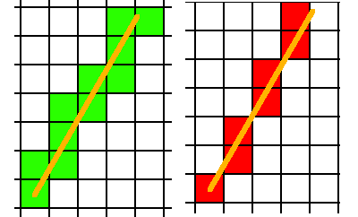
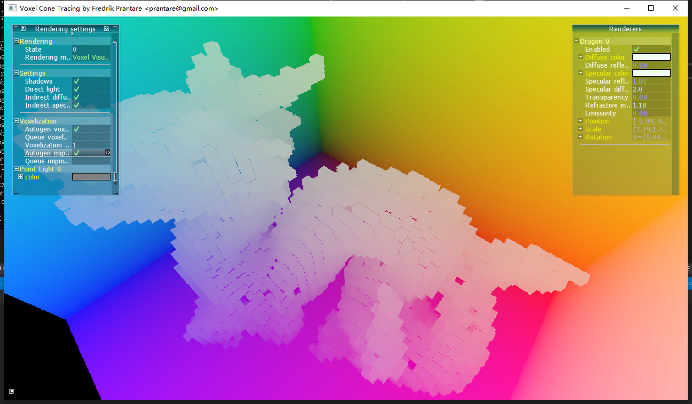
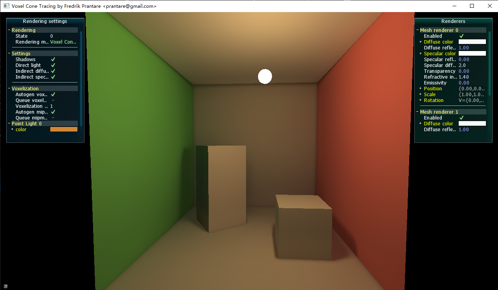
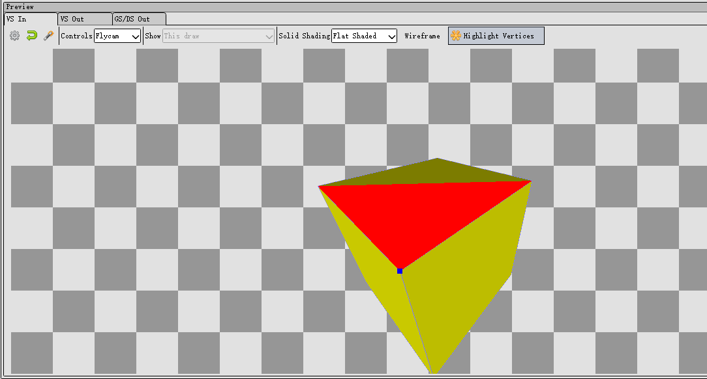
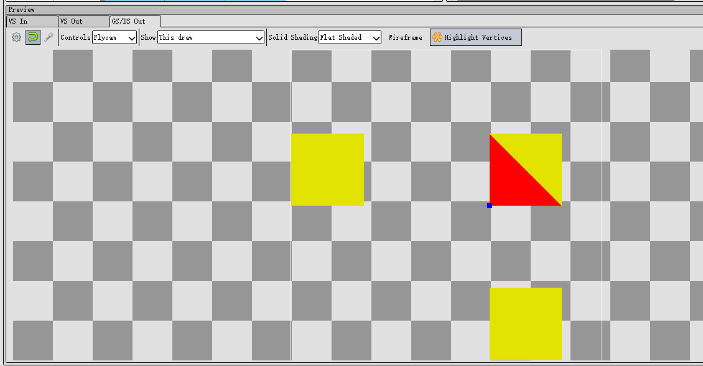
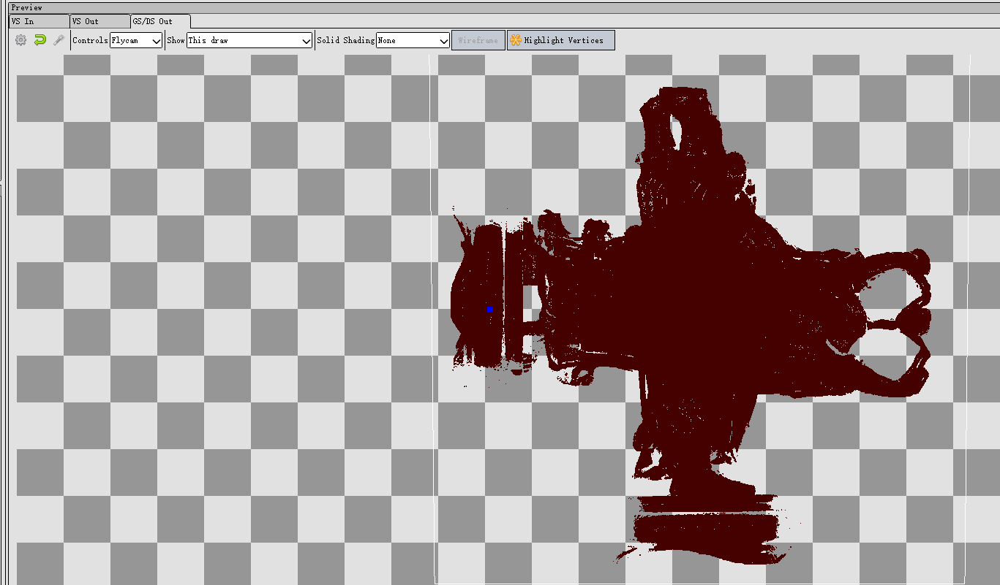
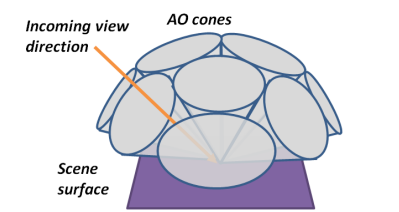

https://github.com/Friduric/voxel-cone-tracing 这个demo很适合入门Voxel GI，本文记录下技术细节的学习。


<!--more-->


## 概念

### 6-separating 和 26-separating 的含义

在把一个三角形转成体素格子时，其实就是在做三维空间的光栅化。在2D的光栅化过程中，一条直线有保守和非保守的画法：




（左边保守，右边不保守）

（直线的CPU光栅化算法：[Bresenham's line algorithm](https://en.wikipedia.org/wiki/Bresenham%27s_line_algorithm)）

类似的，三角形体素化时，也要考虑三角形究竟要覆盖哪些格子，于是也要区分保守和非保守的做法。

非保守的做法是，只考虑前后左右上下，6个相邻格子，这就是6-separating。

而保守的做法，因为3D体素空间，是3x3x3个格子共27个格子，除掉中心块，那么就剩26个格子要考虑，这就是26-separating。

[What does "6-separating" and "26-separating" voxelization mean?](https://computergraphics.stackexchange.com/questions/1790/what-does-6-separating-and-26-separating-voxelization-mean/1791#1791?newreg=7bdc44740364401ea3849a51ce0bb34e)


## 从demo里学习

建议自行下载voxel-cone-tracing代码编译运行并截帧，不然只看本文还是会云里雾里。

### 什么是gpu体素化？

根据demo代码分析，其实可以抽象成几行fragment shader代码：

```c
vec3 scaleAndBias(vec3 p) { return 0.5f * p + vec3(0.5f); }

void main(){
	ivec3 dim = imageSize(texture3D); // 128x128x128
	vec3 voxel_pos = scaleAndBias(worldPositionFrag); // -1...1 to 0...1
	vec3 res; // illuminance 
	imageStore(texture3D, ivec3(dim * voxel_pos), res);
}
```

即根据物体单位化后的世界空间坐标，找出对应的体素离散坐标， 往3D纹理的该位置注入物体的光照信息。

光照信息包括所有光源的直接光照（不考虑遮挡）以及自发光。

把demo的res改成voxel_pos，可以看出体素的分布情况：



可以看出每个体素的颜色都是单一的，没有插值效果，这是因为体素化是在fragment shader写入3D纹理，无论光栅化过程中怎么插值，最终被写入3D纹理之有一个fragment。

### 为什么需要geometry shader

先看代码：

```c
layout(triangles) in;
layout(triangle_strip, max_vertices = 3) out;

in vec3 worldPositionGeom[];
in vec3 normalGeom[];

out vec3 worldPositionFrag;
out vec3 normalFrag;

void main(){
	const vec3 p1 = worldPositionGeom[1] - worldPositionGeom[0];
	const vec3 p2 = worldPositionGeom[2] - worldPositionGeom[0];
	const vec3 p = abs(cross(p1, p2)); 
	for(uint i = 0; i < 3; ++i){
		worldPositionFrag = worldPositionGeom[i];
		normalFrag = normalGeom[i];
		if(p.z > p.x && p.z > p.y){
			gl_Position = vec4(worldPositionFrag.x, worldPositionFrag.y, 0, 1);
		} else if (p.x > p.y && p.x > p.z){
			gl_Position = vec4(worldPositionFrag.y, worldPositionFrag.z, 0, 1);
		} else {
			gl_Position = vec4(worldPositionFrag.x, worldPositionFrag.z, 0, 1);
		}
		EmitVertex();
	}
    EndPrimitive();
}
```

首先因为layout(triangles) in可知，几何着色器的输入是vertex shader输出的三角面（未光栅化）。


同时根据layout(triangle_strip, max_vertices = 3) out，可知输出也是三角面，1比1输出，再结合下面的代码可知这个几何着色器大概就是调整了每个三角面的顶点坐标。

那究竟调整成了什么样呢？

因为三角面有倾斜角度，三角面在xy、yz、xz三个平面上的投影是不一样大的，要找出投影面积最大的那个平面（简单理解就是让三角面变胖才能更好地体素化），可以用面法线来判断。在这个几何着色器里求面法线很简单，因为可以直接获得三个顶点的坐标，用一个cross就得到了。

const vec3 p = abs(cross(p1, p2)); 

注意用了abs，方便后面对p.xyz大小的比较。

然后就看这段代码：

```c
if(p.z > p.x && p.z > p.y) {
	gl_Position = vec4(worldPositionFrag.x, worldPositionFrag.y, 0, 1);
} else if (p.x > p.y && p.x > p.z){
	gl_Position = vec4(worldPositionFrag.y, worldPositionFrag.z, 0, 1);
} else {
	gl_Position = vec4(worldPositionFrag.x, worldPositionFrag.z, 0, 1);
}
```

如果p.z最长，那么说明法线比较偏向正负z，即投影到xy平面能使得三角面面积更大，另外2个case也是这个意思，分别是yz、xz平面。

然后问题来了：不管哪个case，最后的逻辑都是把gl_Position.z分量设为0。那不是把所有三角面都给搞到z为0时的xy平面了？

修改using __DEFAULT_LEVEL = CornellScene并用renderdoc截帧看，确实是这样的：







图3看起来是不是很像三视图？没错，确实是三视图，但是是world space下的，DCC软件里的三视图一般是object space。

图3只看到3个正方形，也是因为正方体完全对称，且摆放位置和坐标轴平行，左右面、上下面、前后面，投影后的位置就会一样，三视图就是3个正方形。

下面继续分析这段代码。

上一节说了体素化其实只和worldPositionFrag有关，修改gl_Position其实不会影响voxel_pos，那么改gl_Position又有什么用呢？

首先要根据vertex shader理解gl_Position，gl_Position其实是view space坐标，最终会变成clip space坐标的。gl_Position用于做光栅化计算，修改gl_Position就是控制光栅化。

光栅化本质是把三角形映射到屏幕上，找出三角形对应了哪些像素点。

综合下来，就可以知道这段代码的思路了：

1.把xy、yz、xz模拟成屏幕平面，根据三角形的法线找出最佳投影面，让三角形投到该'屏幕'。
2.又因为硬件光栅化必须是在xy平面下进行，所以把yz、xz平面的'图像'直接'复制'到xy平面。即挪一下分量位置，例如yz平面的话，(0,y,z)变成(y,z,0)

虽然三视图可能会这样子重叠：




注意，每个视图光栅化产生的fragment并不会因为重叠问题，而被剔除的（因为关了深度测试和背面剔除）。

于是在fragment shader中每个fragment，可能是三视图的任何一个视图的fragment，不同的fragment在屏幕空间中可能是位于同一个位置。但实际上在着色时，并不需要知道是来源于哪个视图，像素重叠与否也不影响。

这里面要深刻理解的是，**fragment的数量和体素化的精度正相关**。这也是为什么要找出投影面积最大的那个平面的原因。

可以这样思考一下，假设我偏偏不找投影面积最大的平面去投影，我找最小的，那会如何呢？比如说在三视图里挑了一个投影面积只有1个像素的平面去光栅化！假设这个物体总共有M个面，其中有N个面cover了这个像素中心点，那么这N个面光栅化后产生的fragment就是N个，且都在同一像素位置。N个fragment会让fragment shader运行N次，假设这些fragment对应的world space pos刚好都能错开并映射到不同的voxel（既然这些fragment都挤到这个像素处，说明world space pos其中有2个分量是接近的，能不能错开要看第三个分量），那也就只是产生N个体素而已。（如果没有错开，那就会产生体素闪烁问题）

假设在另一个视图下这个三角形投影面积很大，可产生10000个fragment（假设N远远达不到这个数），那么用错误的投影就导致了体素的严重退化，从10000个体素退化成N个体素，精度直线下降。

可能说得有复杂，可以再假设一个极其简单的情况：有一个超级狭长的三角形要体素化，在最小投影面仅产生一个fragment（甚至可以一个fragment都没有，即没有cover到像素中心点），而在最大投影面是10000个fragment，就明显发现问题了。


这不是危言耸听，因为3D纹理有限，其实屏幕分辨率是非常低的，在demo里仅仅是64x64：

```c
GLuint voxelTextureSize = 64; // Must be set to a power of 2.
glViewport(0, 0, voxelTextureSize, voxelTextureSize);
```

稍微远离摄像机一点，物体的体素精度就很低了，无论哪个视图都可能只产生了非常少的fragment。


### cone tracing是什么


这也是本文关注重点。

上一节搞定了把场景光照信息注入到了3d纹理中，也就是体素，后面的rendering就可以采样这张3D纹理，获得环境光信息了。但是怎么采样是个大问题。


在demo上实现的是一种叫cone tracing的算法。为啥叫cone呢，是因为在计算环境光对shading point的影响时，不能只发射一条射线（这是ray tracing），而是要往周围发射N条射线，那么问题来了，可能得发射非常多的射线、以及实现重要性采样，才能获得比较准确的结果，计算成本比较高。

cone tracing的最大优点是把射线方向固定成**9个**，如下图：



diffuse部分cone tracing代码如下：

```c
// Returns a vector that is orthogonal to u.
vec3 orthogonal(vec3 u){
	u = normalize(u);
	vec3 v = vec3(0.99146, 0.11664, 0.05832); // Pick any normalized vector.
	return abs(dot(u, v)) > 0.99999f ? cross(u, vec3(0, 1, 0)) : cross(u, v);
}

vec3 indirectDiffuseLight(){
	const float ANGLE_MIX = 0.5f; // Angle mix (1.0f => orthogonal direction, 0.0f => direction of normal).
	const float w[3] = {1.0, 1.0, 1.0}; // Cone weights.
	// Find a base for the side cones with the normal as one of its base vectors.
	const vec3 ortho = normalize(orthogonal(normal));
	const vec3 ortho2 = normalize(cross(ortho, normal));
	// Find base vectors for the corner cones too.
	const vec3 corner = 0.5f * (ortho + ortho2);
	const vec3 corner2 = 0.5f * (ortho - ortho2);
	。。。
	// Accumulate indirect diffuse light.
	vec3 acc = vec3(0);
	// Trace front cone
	acc += w[0] * traceDiffuseVoxelCone(C_ORIGIN + CONE_OFFSET * normal, normal);

	// Trace 4 side cones.
	const vec3 s1 = mix(normal, ortho, ANGLE_MIX);
	const vec3 s2 = mix(normal, -ortho, ANGLE_MIX);
	const vec3 s3 = mix(normal, ortho2, ANGLE_MIX);
	const vec3 s4 = mix(normal, -ortho2, ANGLE_MIX);

	acc += w[1] * traceDiffuseVoxelCone(C_ORIGIN + CONE_OFFSET * ortho, s1);
	acc += w[1] * traceDiffuseVoxelCone(C_ORIGIN - CONE_OFFSET * ortho, s2);
	acc += w[1] * traceDiffuseVoxelCone(C_ORIGIN + CONE_OFFSET * ortho2, s3);
	acc += w[1] * traceDiffuseVoxelCone(C_ORIGIN - CONE_OFFSET * ortho2, s4);

	// Trace 4 corner cones.
	const vec3 c1 = mix(normal, corner, ANGLE_MIX);
	const vec3 c2 = mix(normal, -corner, ANGLE_MIX);
	const vec3 c3 = mix(normal, corner2, ANGLE_MIX);
	const vec3 c4 = mix(normal, -corner2, ANGLE_MIX);

	acc += w[2] * traceDiffuseVoxelCone(C_ORIGIN + CONE_OFFSET * corner, c1);
	acc += w[2] * traceDiffuseVoxelCone(C_ORIGIN - CONE_OFFSET * corner, c2);
	acc += w[2] * traceDiffuseVoxelCone(C_ORIGIN + CONE_OFFSET * corner2, c3);
	acc += w[2] * traceDiffuseVoxelCone(C_ORIGIN - CONE_OFFSET * corner2, c4);

	// Return result.
	return DIFFUSE_INDIRECT_FACTOR * material.diffuseReflectivity * acc * (material.diffuseColor + vec3(0.001f));
}

```

整体步骤如下：

1. orthogonal里固定一个随意挑选的v，用v去和normal做叉积，获得一个和normal正交的向量ortho
2. 用第一步得到的向量，再次和normal做叉积，得到一个分别和normal、ortho正交的向量ortho2。normal、ortho、ortho2够成一个shading point的正交坐标轴
3. 再算出这个坐标系偏转45度后的新的2个基向量corner、corner2
4. 分别算出normal和4个方向+ortho、-ortho、+ortho2、-ortho2的中间向量s1、s2、s3、s4，这才是真正的射线方向，即斜45度发射射线。corner、corner2同理。
5. traceDiffuseVoxelCone 法线方向
6. traceDiffuseVoxelCone s1、s2、s3、s4四个斜45度方向
7. traceDiffuseVoxelCone c1、c2、c3、c4这四个绕了normal旋转45度后，再往normal倾斜45度的方向
8. 把这9个方向的返回值算加权和，就是环境光照结果了，返回时要乘以shading point的材质的漫反射率即diffuseColor（albedo）

接着看traceDiffuseVoxelCone:

```c
// Traces a diffuse voxel cone.
vec3 traceDiffuseVoxelCone(const vec3 from, vec3 direction){
	direction = normalize(direction);
	
	const float CONE_SPREAD = 0.325;

	vec4 acc = vec4(0.0f);

	// Controls bleeding from close surfaces.
	// Low values look rather bad if using shadow cone tracing.
	// Might be a better choice to use shadow maps and lower this value.
	float dist = 0.1953125;

	// Trace.
	while(dist < SQRT2 && acc.a < 1){
		vec3 c = from + dist * direction;
		c = scaleAndBias(from + dist * direction);
		float l = (1 + CONE_SPREAD * dist / VOXEL_SIZE);
		float level = log2(l);
		float ll = (level + 1) * (level + 1);
		vec4 voxel = textureLod(texture3D, c, min(MIPMAP_HARDCAP, level));
		acc += 0.075 * ll * voxel * pow(1 - voxel.a, 2);
		dist += ll * VOXEL_SIZE * 2;
	}
	return pow(acc.rgb * 2.0, vec3(1.5));
}
```

有很多magic number，本文就不深究怎么来的了，毕竟这个demo是学生作品。

理解下流程就好了。

循环里先算出当前采样坐标c，其中dist是射线长度；接着c转换到3D纹理的uvw坐标系中，即0..1；然后是算lod level，这个的计算方法不是可以泛化的，这里只能理解成和射线长度相关，射线越长，lod level越大，3D纹理精度越低，即采样范围越大；接着采样3D纹理获得illuminance值，累加到acc，并迭代dist。

最后返回前又有一条magic formula，也没注释，不知道什么含义，看起来是放大了acc值。

总的来说，**cone tracing就是利用3D纹理多层lod，实现了像圆锥一样的，越接近圆锥顶点(起点)，采样范围越小，越远离圆锥顶点，采样范围越大的效果**。

另外注意，这里面其实有考虑occlusion的问题的。不考虑遮挡的话，被遮挡物的体素值也被算进去，就不准了。关键原理在于voxel.a值，当采样到一个完全不透明的体素值，这个体素就是遮挡物，沿着这个射线继续采样也没有必要了。把射线沿路的voxel.a叠加到acc.a，并且当acc.a >= 1时，采样终止。

### 如何debug体素化后的结果

demo里用的是一个全屏ray marching的做法：

1. 打开深度测试，正常渲染场景的正面和背面，分别写入到textureBack和textureFront2个FBO
2. 然后用一个后处理，在fragment shader里，根据textureBack、textureFront算出ray origin、ray dir（其实大可不必），然后沿着这个方向每走一步采样一下3D纹理，也是用alpha值才终止循环


## 参考资料

https://www.seas.upenn.edu/~pcozzi/OpenGLInsights/OpenGLInsights-SparseVoxelization.pdf

https://github.com/otaku690/SparseVoxelOctree

https://github.com/Friduric/voxel-cone-tracing