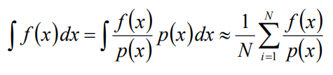

<!--more-->

# 三种坐标系

## 矩坐标

矩坐标似乎是中文网络上才有的说法，正确叫法是[笛卡尔坐标系](https://en.wikipedia.org/wiki/Cartesian_coordinate_system)。

## 柱坐标

[柱坐标](https://en.wikipedia.org/wiki/Cylindrical_coordinate_system)其实就是圆的定义的延伸。柱的横截面是圆，圆有一个半径r和角度φ，柱则还有一个厚度维度z。

## 球坐标

[球坐标](https://en.wikipedia.org/wiki/Spherical_coordinate_system)是极坐标的三维形式。

# 基函数和投影和重建

## 基函数和正交

假设3D空间中有一个点P，记它的位置为函数f，f究竟是个什么东西呢？或者说怎么用数学描述f？

答案是用坐标系，坐标系的本质就是一组**正交的基函数(basis)**。

大家知道3D空间的笛卡尔坐标系有3个basis：(1,0,0)、(0,1,0)、(0,0,1)。这3个基向量是正交的。

正交性有2个特点：

- 任意2个不同的basis之间点积结果为0
- 任意一个basis和它自己做点积，结果为常数c

用积分式子表达这个正交关系：

（当C为1时，其中的F称为正交基函数orthonormal basis functions）

有了这个概念后，f这个事情就有了下一步的方向了：**怎么用(1,0,0)、(0,1,0)、(0,0,1)描述f？**

## 投影

假设这个3D空间中有另一个参数物O，那么P究竟离O**有多远呢**

假设没有其他工具、且人眼变成了一个正交相机，那么可以用三视角来判断P和O的距离：

- 站在P的正面，观察P和O的相对位置，即得到P在xy平面的投影点
- 站在P的侧面，观察P和O的相对位置，即得到P在yz平面的投影点
- 站在P的头顶，观察P和O的相对位置，即得到P在xz平面的投影点

平面上的投影点P'，和O的关系又怎么办呢？因为我们已经通过三视图把三维问题降成了二维问题，同理也可以把二维问题降到一维，即继续把P投影到三个basis轴上得到P''。P''和O的距离就好办了，用尺子量。

通过这个降维的办法，最终就能得到P在三个basis(1,0,0)、(0,1,0)、(0,0,1)上的投影距离x、y、z，一般也叫**投影系数**。也可记为：(x,0,0)、(0,y,0)、(0,0,z）。

同时f可以记为f=(x,y,z)。f的投影过程可以数学描述了。

记basis为\\(\\mathbf B\_{i}\\), f在\\(\\mathbf B\_{i}\\)投影系数记为\\(C\_{i}\\)，并拓展f到任意维度、任意坐标系：

\\[ C\_{i} = \\mathbf f  \cdot \\mathbf B\_{i} \\]

验证：

\\[ (x,y,z) \cdot (1,0,0) = x \\]
\\[ (x,y,z) \cdot (0,1,0) = y \\]
\\[ (x,y,z) \cdot (0,0,1) = z \\]

**到了这里，f到三个basis的投影问题就解决了。接下来讨论的是怎么用basis和投影参数，重建f**。

## 重建

很简单，f其实就是三个basis和三个投影系数分别相乘后的累加：

\\[ (1,0,0) * x =  (x,0,0) \\]
\\[ (0,1,0) * y =  (x,y,0) \\]
\\[ (0,0,1) * z =  (0,0,z) \\]
\\[ f = (1,0,0) * x + (0,1,0) * y + (0,0,1) * z = (x,y,z)  \\]

也可以用矩阵的形式表达：





\\[  \\mathbf f =    \\]

更标准的描述：

\\[  \\mathbf f = \\sum\_\{i=1\}\^\{n\} \\mathbf B\_{i} C\_{i} \\]

注意这里的\\(\\mathbf B\_{i}\\)基函数究竟是什么样的是不确定的，可能是上面的笛卡尔基函数，也可能是球坐标基函数，当然最重要的是下文会提到的球谐基函数。

综上，当f未知而\\(C\_{i}\\)已知时，我们可以用上述公式**重建**出f。

# 数学期望和蒙特卡洛积分

## 数学期望

数学期望是随机变量输出值的加权平均，连续随机变量的数学期望公式如下：

其中的p是概率密度函数，p的积分需要等于1。

举一个例子，求f(x) = 2 - x在定义域[0, 2]的数学期望值。需要先构造一个概率密度函数p，p显然等于1/2。于是有：

## 蒙特卡洛积分

对于没有解析式或者不好算积分的f(x)，可以用离散采样f(x)并加权求平均的方法求数学期望：

再结合上一节的式子：

就可以用来算f(x)的积分了（不是数学期望！）：

这也就是所谓的蒙特卡洛积分了。
